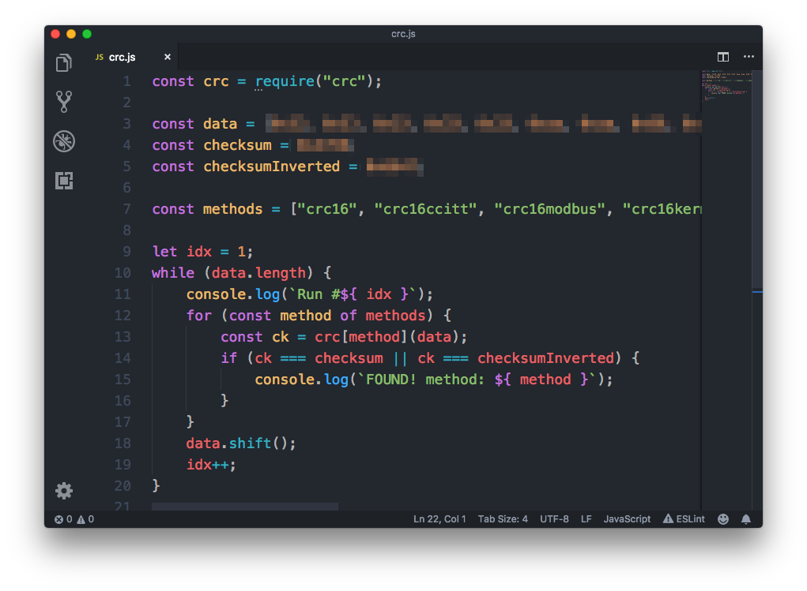

[원글 링크](https://gall.dcinside.com/hit/15017)

아이유 공식 응원봉은 기본적으로 네온옐로우 색 밖에는 낼 수가 없는데, 버튼 꾹 눌러서 켜면 네온 옐로우색으로 발광되고, 버튼 누를때마다 깜빡거리는 속도만 달라지는 식이다. 다른 색깔을 내는건 콘서트장에서 중앙 제어 시에만 가능하고, 이외에는 오직 네온옐로우색만 발광이 가능하다.

뭐 중앙 제어 안하는 상황에서는 한가지 색으로 통일하는게 이쁘니까 이해는 가는데... 기능이 있는데 못쓰고 썩히는게 맘에 안들기도 하고 ~~심심해서~~ 응원봉이 처음 나오고 받아본 직후 바로 분해해서 갖고 놀기 시작했다.

당연하겠지만 응원봉 색을 바꾸는 최고의 방법은 콘서트장에서 하는 원격 제어 방식을 직접 구현해서 하는 것으로, 응원봉 개조를 전혀 안하고 색 바꾸기가 가능함.

물론 무식한 방법으로 응원봉 안의 회로를 수정하거나 아예 바꿔치기 해서 색 바꾸는 방법도 있다.

> [https://www.instructables.com/id/Hacking-a-Xyloband-With-Arduino/](https://www.instructables.com/id/Hacking-a-Xyloband-With-Arduino/)

이렇게. 사진은 콜드플레이 공연에서 쓰는 Xyloband.

근데 이렇게 하는게 무슨 의미가 있겠는가. 원격 제어를 해보도록 하자.

---

현존하는 응원봉 중앙 제어 방식에는 크게 세가지가 있다.

1. 응원봉을 스마트폰과 블루투스 페어링 후 제어

앱으로 블루투스와 연결해서 쓰는 응원봉이 전부 이 방식이고,

- 응원봉은 스마트폰이랑만 연결되고 스마트폰 - 중앙 서버랑 통신하는 방식이랑
- 스마트폰은 설정용으로만 쓰고 응원봉 - 컨트롤러가 ZigBee나 RF 등등 무선으로 직접 연결되는 방식
  으로 또 나뉘는걸로 보인다.

스마트폰 앱을 통해 좌석 번호를 입력해서 콘서트장에서 각 좌석을 개별로 제어할 수 있고, 이를 이용해서 구역별 색깔, 글자 쓰기 등등 세부적인 연출이 가능하다. 집에서도 스마트폰 앱을 통해 응원봉 색을 바꾸고 놀 수도 있다.

...슬프게도 아이유 응원봉은 이런 기능이 없다. 됐으면 내가 이 글을 안썼겠지

물론 특허도 걸려있고 블루투스도 들어가야되고 앱도 만들어야되니 단가가 비싸지는게 단점

2. 사전에 좌석 정보 등을 응원봉에 저장해두고 컨트롤러로 제어

주로 1회성 행사에서 쓰는 방식이고, 응원봉에 미리 좌석 정보를 심어두고 그걸 자리마다 놔둔 뒤에 컨트롤러로 제어하는 방식.

비싼 블루투스 쓸 필요 없이 구역별, 좌석별 제어가 가능하지만, 1회용이다. 한번 사서 콘서트마다 들고가는 공식 응원봉에는 못써먹는 방식으로, 콜드플레이 내한 공연이랑 가요대전 때 썼던 LED 팔찌가 이 방식으로 보인다.

3. 그런거 없이 컨트롤러 - 응원봉 직접 통신

좌석, 구역별 제어를 포기하고 그냥 중앙에서 컨트롤러가 색상 정보를 뿌리고, 이에 따라 응원봉 색이 바뀌는 방식.

그렇다 아이유 응원봉은 이 방식이다. 뭐 대부분 공식 응원봉은 다 이 방식인거 같긴 하다만...

문제는 통신 방식은 뭘 쓰던 응원봉 만드는놈 마음이라는 것. 알려진 Wi-Fi나 Bluetooth, ZigBee 등의 프로토콜을 쓸 수도 있고, 그냥 RF 써서 맘대로 만들수도 있다.

이게 가장 큰 문제다. 원격 제어를 하고 싶어도 어떤 방식으로 하는지 전혀 모르니 뭘 할 수가 없으니...

---

> [https://github.com/StefanKrupop/XyloShield](https://github.com/StefanKrupop/XyloShield)

GitHub를 찾아보면 위에서 말했던 Xyloband를 제어하는 하드웨어 소스가 공개되어 있다. 하지만 위에서 말했듯 통신 방식은 만드는 놈 맘이고 전혀 다르기 때문에 이걸로 아이유 응원봉은 제어가 불가능하다.

그리고 Xyloband 제어용으로 저런걸 만들 수 있는 이유는,

> [http://xylobands.com/coldplay-tour-a-head-full-of-dreams/](http://xylobands.com/coldplay-tour-a-head-full-of-dreams/)

바로 Xyloband 만드는 제조사가 아예 컨트롤러를 팔기 때문. GitHub 보고 도면 뽑아서 납땜하는 뻘짓을 하지 않더라도, 그냥 저거 사다가 집에서 갖고 놀면 된다.

...파는걸 그냥 사서 쓰면 되는데 굳이 이걸 사다가 역분석해서 다시 만드는 이유는 이해할 수 없지만 (뭐 재미는 있을거 같긴 한데...) 어찌됐든 아이유 응원봉 컨트롤러를 따로 팔지는 않으므로 매우 접근이 어려워진다.

---

어찌됐든 아이유 응원봉의 통신 방식을 알아내야 되니... 일단 검색을 해보자.

응원봉을 사면 이렇게 제품 사양이 들어있는데, 원하는 통신 방식 같은건 당연히 보이질 않는다. 누가 그런거까지 적어놓겠냐만...

전파 인증 번호가 보이니 검색을 해본다.

...이게 전부다

미국의 FCC 인증은 시험 성적서를 공개하고 있어서 위의 사진처럼 통신 주파수, 변조 방식까지 쉽게 얻을 수 있지만, 한국의 전파 인증은 그런거 없다.

아무튼 저기서 얻은 정보는 제품에 표시된 제조사는 휴앤휴지만 실제 인증을 받은 제조사는 비트로라는거다.

비트로를 찾아보니 아이유 말고 다른 아이돌 응원봉도 많이 만들었다.

컨트롤러도 있다. 이걸 팔아주면 좋으련만....

홈페이지([http://www.beatro.co.kr](http://www.beatro.co.kr))를 가보니 더 많다.

기술 소개 항목이 있어 엄청 기대하고 들어갔는데... 텅 비어있다. -\_-

2017년에도 이상태였는데 이 글을 쓰는 2019년까지 이상태인걸 보면 넣을 생각이 없는 모양이다.

---

검색을 통해 얻을 수 있는 정보는 이게 전부인거 같다.

일단 응원봉을 분해해보자.

분해를 했는데.... 기판에 검은색 껌이 보인다 ㅡ.ㅡ

저리 생겨먹은건 Chip On Board 또는 분석을 방해하기 위해 발라놓은건데, 떼려면 열풍기로 가열하면서 칼로 긁어내던가, 아님 강산을 통해 저 부분만 녹이던가 해야된다.

> [https://www.youtube.com/watch?v=hQ5hXEK35WI](https://www.youtube.com/watch?v=hQ5hXEK35WI)

이렇게...

문제는 저렇게 하면 당연히 응원봉이 망가지고, 다 벗겨내더라도 현미경을 통해 회로를 분석해야 한다.

그래서 저걸 분석하는건 깔끔하게 포기.

칩셋 정보를 안다면 펌웨어를 추출한 다음 리버스엔지니어링 하는 식으로 컨트롤러 없이도 통신 방식이나 패킷 구조를 파악할 수 있다.

예를 들어 SBS 가요대전에서 사용된 LED 팔찌는 TLSR8261 칩을 쓰는데, 해당 칩셋명을 검색해서 Datasheet를 찾으면 세부 사양을 다 알 수 있다.

문제는 아이유 응원봉의 기판에는 저런 칩셋 정보가 전무하다는 것.

그러다가 검색 중 똑같은 제조사에서 만든 박효신 콘서트 팔찌에는 IC가 그대로 보인다는 것을 발견했다.

그래서 중고나라에서 박효신 콘서트 팔찌를 구입. 물론 같은 제조사더라도 통신 방식이 다를 수 있지만, 보통 제조사가 같으면 통신 방식도 비슷한 경우가 대부분이기에 일단 샀다.

봤던 사진처럼 IC가 그대로 나와있다!

....근데 하나는 아예 식별번호가 없고, 하나는 식별번호가 있긴 한데 검색해도 아무것도 안나왔다. 추측상 하나는 마이크로컨트롤러고 하나는 무선 모뎀인 듯 싶은데, 식별번호가 없으니 알 방법이.... 식별번호가 있는 IC에 비트로 회사 로고 비스무리한게 같이 적혀있는거 봐서는 아마 커스텀 IC일 가능성이 높아보인다.

즉 여기서도 얻을 수 있는 정보는 없다는 얘기. ~~꽝~~

---

위에서의 각종 사전 분석 끝에 실제 제어 정보를 송신하는 컨트롤러 없이는 원격 제어 방식을 파악하는게 불가능하다고 결론내렸고, 응원봉 중앙 제어가 이뤄지는 콘서트 때까지 기다린 후, 콘서트 동안 제어 정보를 저장한 뒤 분석 해야겠다고 생각했다.

그렇게 콘서트 공지가 뜨기까지 1년을 기다렸다.

자, 그럼 콘서트 때 중앙 제어 정보를 어떻게 따올까?

일단 모든 주파수 대역을 다 따올 수는 없으니 통신 주파수부터 알아야 한다. 문제는 파트 1에서 봤듯이 통신 주파수와 변조 방식이 상세히 나오는 FCC 인증과는 다르게 한국의 전파 인증은 그런거 안알랴줌이라는 것.

다행히 이 문제는 간단히 해결되었는데,

응원봉 판매 페이지에 2.4Ghz 무선컨트롤 기능 이라고 친절하게 적혀 있었기 때문.

뭐 그냥 저렇게 아무렇게나 적어놓고 실제로는 다른 주파수 대역을 쓸 수도 있지만... 일단 믿어보기로 했다.

ISM 밴드는 별도로 허가나 신고를 하지 않아도 사용할 수 있는 주파수 대역인데, 2.4Ghz 대역의 ISM 주파수 대역은 2.4~2.4835Ghz 이다. Wi-Fi, Bluetooth 등이 쓰는 대역이다.

즉, 콘서트 동안 요 주파수 대역을 저장해두면 된다는 얘기.

그걸 위해 라즈베리 파이에 보조배터리, 수신 장비를 연결해놓고 콘서트 동안 가방 안에 넣고 켜두었다.

내가 갖고있는 수신 장비로는 한번에 10Mhz 대역만 캡쳐가 가능해서, 1분씩 대역을 바꿔가며 저장하는 간단한 스크립트를 짠 뒤 라즈베리파이가 켜지면 자동으로 실행되도록 세팅했다.

특성상 주파수 캡쳐 파일은 크기가 매우 크기 때문에, 라즈베이파이에 256GB SD 카드를 끼워놨는데도 금방 용량이 바닥난다.

라즈베리파이 IO 성능이 너무 구려서 쓰기 속도를 못따라가길래 SD 슬롯도 오버클럭하고 메모리 버퍼 잡아주고 딜레이 넣고 하여간 튜닝에 좀 애먹었다. 인텔 보드 쓰면 상관 없었을텐데 노는게 없어서...

아무튼 이렇게 캡쳐된 파일을 그대로 다시 재생하면,

빙고!

이렇게 단순히 주파수를 캡쳐했다가 다시 재생하는걸 Replay Attack이라고 하는데, 패킷에 시간 정보만 넣어도 간단히 막히지만 응원봉에 RTC 같은걸 넣을리가 없다.

여기까지만 해도 원하는 목표는 거의 달성했다고 볼 수 있다.

이제 캡쳐된 파일을 색깔별로 자르고 원하는 부분만 추출한 뒤 간단한 GUI를 만들어주면,

<iframe width="560" height="315" src="https://www.youtube.com/embed/gE12w3izLtE" frameborder="0" allow="accelerometer; autoplay; encrypted-media; gyroscope; picture-in-picture" allowfullscreen></iframe>

이렇게 원격 제어를 통해 색깔 바꾸기가 가능하다.

---

여기까지만 해도 목표는 달성했지만, 뭔가 2% 마음에 들지 않는다.

왜냐면 저 방식으로는 지정된 몇가지 색으로만 바꿀 수 있고 내가 원하는 색을 만들 수 없기 때문인데,

좀 더 나아가서, 패킷을 분석해서 원하는 색을 만들어보자.

먼저 캡쳐된 데이터를 FFT 돌리고 Waterfall을 뿌려보면, 위처럼 시간 대역에서 주파수의 변화를 볼 수 있다. 저렇게 생겨먹은건 딱봐도 FSK다.

FSK인걸 알았으니 복조를 해봅시다.

이렇게 넣고 돌리면

이렇게 복조된 파형이 나온다.

이걸 바이너리로 변환하고, 각 색깔별로 이 과정을 반복하면 색이 바뀔 때 패킷 중 가운데 일부만 변함을 알 수 있다.

이렇게.

눈치가 좋다면 바뀌는 저 3 바이트가 RGB 색상값이라는걸 알아챘을텐데, 여기까지를 통해 추측한 패킷 구조는 아래와 같다.

그럼 이제 원하는 색상 값을 넣고 다시 변조해서 송신해보자.

근데 안된다 -\_-

무선 통신이니 오류를 감지하기 위한 CRC가 있는걸로 예상되니, 어떤 CRC 방식을 쓰고 있는지 때려맞춰보자.

역시 이런건 무작위 대입이 최고...

예상대로 CRC가 맞고, 방식도 찾았다.

즉 이렇게 생긴 프로토콜로 추측.

...근데 이렇게 해도 안된다 -\_-

가만히 보니 가운데 바뀌는 패킷이 한 바이트 더 있다.

어차피 1바이트라 2^8 = 256가지밖에 안나오므로 모든 경우의 수 무작위 대입해서 색이 바뀔 때까지 돌려보자.

그 결과 색상값 3바이트를 XOR 연산하고 offset을 조정한 일종의 checksum으로 파악됐다.

따라서 최종 프로토콜 구조는 위와 같은 것으로 추정.

여기까지 얻은 정보를 바탕으로 간단한 패킷 생성 스크립트를 짜면

<iframe width="560" height="315" src="https://www.youtube.com/embed/QdMERlqQ1qY" frameborder="0" allow="accelerometer; autoplay; encrypted-media; gyroscope; picture-in-picture" allowfullscreen></iframe>

이렇게 입력받은 색상값으로 응원봉 색을 바꿀 수 있다.

---

여기서 끝내기 아쉬우니 컴퓨터 없이 들고 다닐 수 있게 만들어보자.

보드는 ESP8266이 달린 NodeMCU를 썼다. 와이파이가 붙어있어서 스마트폰이랑 연결하기도 편하고, 성능도 아두이노보다 훨씬 좋다.

뚝딱 코딩해서 넣어주고,

UI도 대충 만들어서 넣어주면,

<iframe width="560" height="315" src="https://www.youtube.com/embed/q1sWSydrq8U" frameborder="0" allow="accelerometer; autoplay; encrypted-media; gyroscope; picture-in-picture" allowfullscreen></iframe>

끝!
