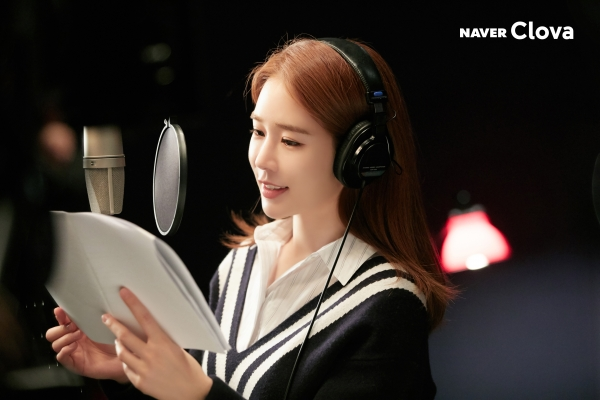
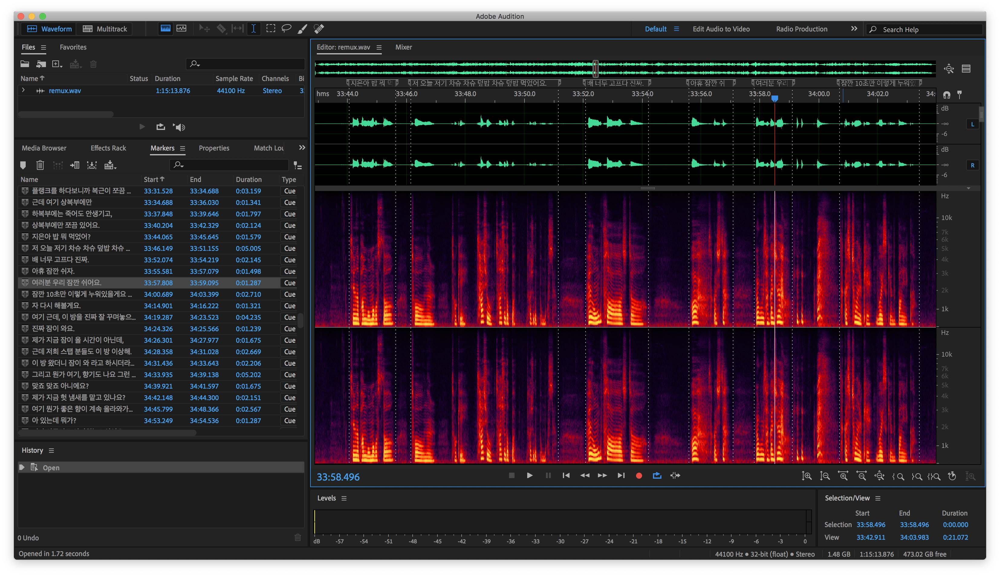
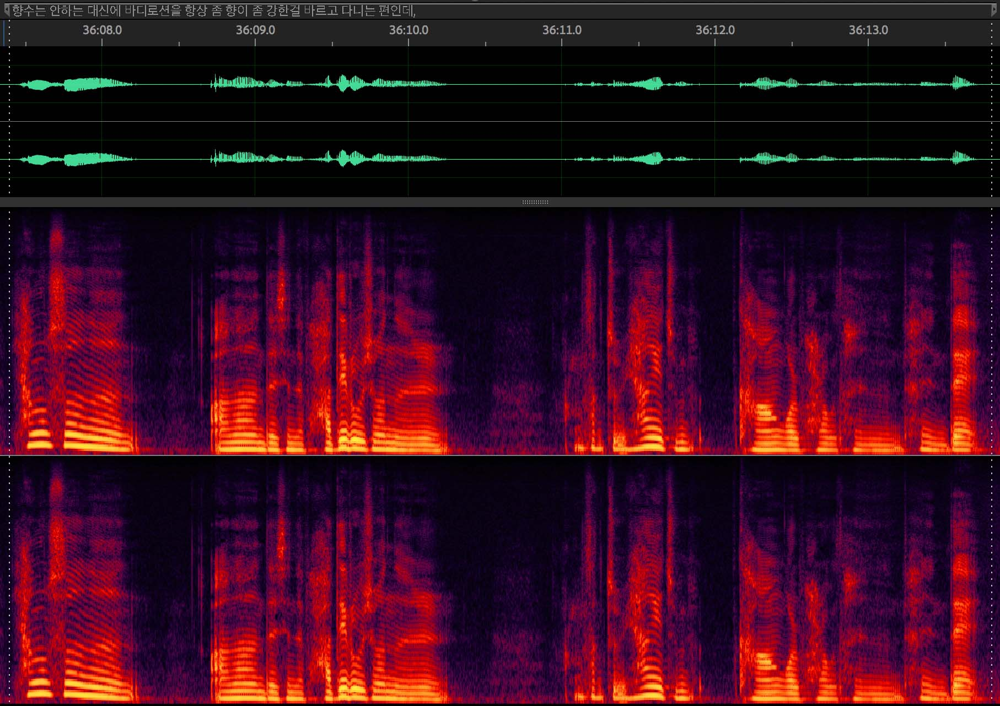
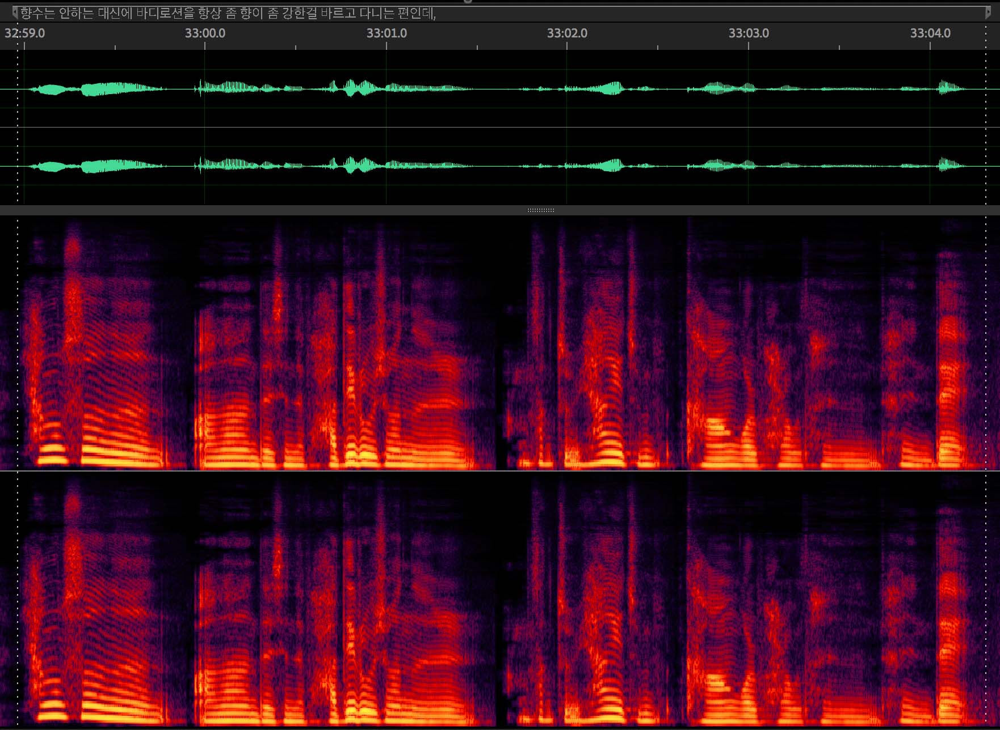
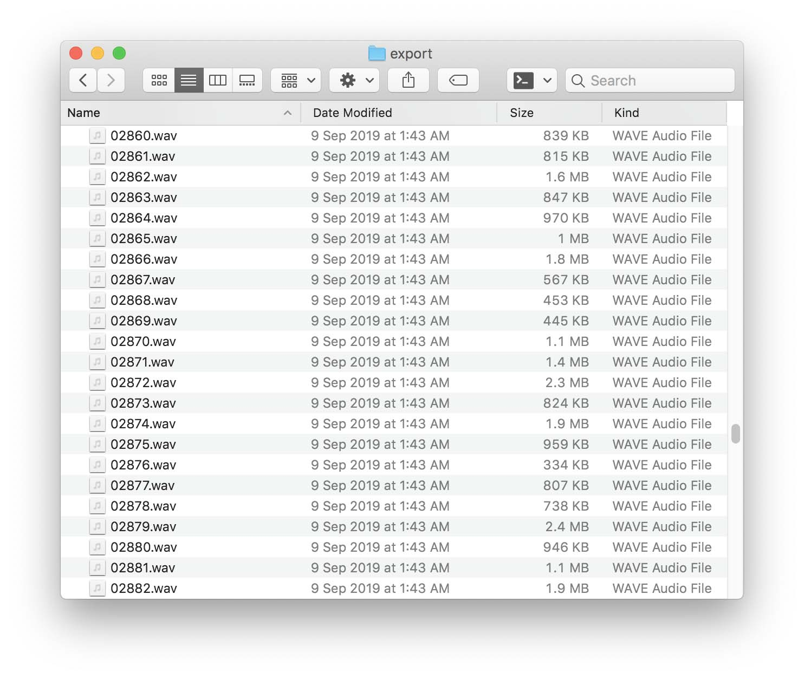
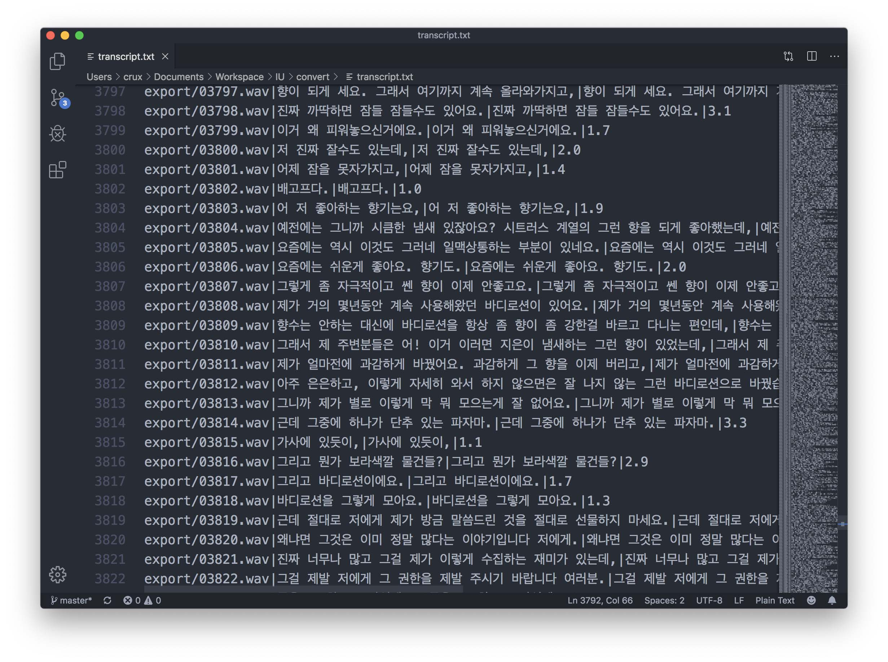

딥러닝이 유행하기 시작한 이후로, 기존 분야들에 딥러닝을 적용했을 때 비약적인 성능 향상을 경험하는 경우가 점점 많아지고 있다. TTS도 그러한 분야 중 하나인데, 수많은 단어를 일일이 읽고 이를 알맞게 합성하는 알고리즘을 수동으로 구현했던 과거와는 다르게 충분한 양의 음성-문장을 입력하면 스스로 음성 합성 방법을 학습하는 End-to-End 딥러닝 모델들이 최근 몇 년 새에 많이 나왔다.

> [WaveNet: A Generative Model for Raw Audio](https://deepmind.com/blog/wavenet-generative-model-raw-audio/)

바둑 두는 알파고로 유명한 구글의 DeepMind가 이 부분에서도 앞서 나가고 있는데, Tacotron-2와 WaveNet으로 합성한 음성은 사람과 구별하기 어려울 정도이다. 최근 들어서는 단순 TTS를 넘어 영어로 된 음성을 스페인어로 바꾸면서 같은 사람의 목소리를 유지한다든지, 문장을 읽을 때의 감정을 조절할 수 있게 한다든지 등등 엄청난 짓들을 하고 있더라.

> [carpedm20/multi-speaker-tacotron-tensorflow](https://carpedm20.github.io/tacotron/)

아쉽게도 대부분의 딥러닝 관련 연구는 영어 위주로 진행된다. 물론 딥러닝이기 때문에 언어에 국한되는 점은 많지 않아서 약간의 수정을 통해 다른 언어에도 적용이 가능한 경우가 많다. 예를 들어 2017년에 공개된 _carpedm20_ 의 **multi-speaker-tacotron-tensorflow**가 있는데, Tacotron 기반에 Baidu의 Deep Voice 2의 multi-speaker 구현을 더해 한국어를 적용했다. 위의 링크에서 15+ 시간의 데이터로 학습한 샘플을 들어볼 수 있다.

> [clova.ai](https://clova.ai/ko/events/celeb_voice/)

네이버는 유인나의 목소리를 적용한 음성 합성 엔진을 내놨다. 처음에는 오디오북으로 시작해서, 네이버의 인공지능 비서인 **Clova**에도 해당 음성을 적용했다. 잠깐 앱을 깔아서 써봤는데, 굉장히 자연스럽다.

---

처음 Tacotron을 접한 이후, 아이유 목소리로도 만들어보고 싶다는 생각이 들었다. 카카오에서 인공지능 스피커를 내놓으면서 유명인 목소리를 적용해줄 것처럼 설문조사도 하고 하더니만, 한참 지난 지금도 감감무소식...

그래서 직접 만들어 보기로 했다.

...라고 생각한 지는 한참 되었지만 막상 시작하진 않았던 이유는 학습 데이터 때문이었다.

딥러닝이 다 그렇듯 좋은 결과를 얻기 위해서는 최대한 많은 양의 학습 데이터가 필요하다. 문제는 그 학습 데이터를 만드는 방법이라는 게 사실상 노가다이기 때문.

_carpedm20_ 의 구현에서는 오디오를 공백 기준으로 분할한 뒤 구글의 음성 인식 API를 사용해 이를 텍스트로 변환하여 학습 데이터를 생성하는 방법을 제안하고 있는데, 이건 연설이나 손석희같이 뉴스 브리핑 등 정제된 데이터를 대상으로나 쓸만하지 아이유 같은 데이터셋에는 적용이 어렵더라.

시도해보긴 했는데 데이터를 보정하는데 시간이 더 들어간다. 아니 일단 공백을 기준으로 문장이 끊어지는 경우가 잘 없다...

결론은 딥러닝 학습을 위해서는 아이유 음성 데이터를 추출해서 학습에 필요한 3~4초 길이로 나누고 문장을 받아쓰기하는 과정을 노가다로 해야 한다.

이 프로젝트가 2019년 7월부터 시작해 3개월 동안 진행된 주된 이유가 바로 이 학습 데이터 준비 과정 때문이다. 전체 소요 기간을 백분율로 나누자면 코딩이 10%, 모델 학습 시간이 20%, 학습 데이터 준비가 70% 이상을 잡아먹은 것 같다.

---

어쨌든 쓸만한 학습 데이터를 최대한 빠르게 얻어내기 위해 내가 사용한 방법은 이렇다.

먼저 아이유의 음성 데이터를 준비해야 한다. 아이유 음성 데이터 구하는 것쯤은 쉬울 거라고 생각했지만, 이것도 쓸만한걸 구하는 건 쉽지 않았다. 일단 **1) 배경음악이 없어야 하고, 2) 배경 노이즈도 없어야 하며, 3) 여러 명이 동시에 말하는 경우 대화가 겹치면 안 된다**는 조건이 붙는다. 위 조건을 모두 만족하는 것만 남기면 생각보다 쓸만한 게 별로 없다.

대부분의 TV 프로그램은 배경음악 때문에 건질 게 별로 없었고 아이유 TV는 노이즈 때문에 쓸 수 없었다. 라디오, V앱 등이 가장 좋았고 인터뷰들도 사용했다.

쓸만한 데이터를 찾으면 WAV 파일로 변환한 뒤 Audition에서 열어서 문장 단위로 Marker를 설정하고 받아쓰기한다.

이렇게.

아이유가 아닌 다른 사람 목소리였으면 하다가 때려쳤을 무진장 귀찮고 지루한 작업이다.

이렇게 마킹을 다 하면 Audition을 이용해 최대한 배경 노이즈를 제거해주고 음성 사이의 공백과 숨소리도 제거한다.

공백 제거 자체도 꽤 귀찮은 작업이지만 이걸 안 해주면 학습된 모델이 띄어쓰기를 못 한다.

이렇게 2시간 정도의 데이터를 가공하면 총 2-30분가량의 음성 데이터가 나오게 된다. 문제는 2시간짜리를 저렇게 가공하려면 10시간이 훨씬 넘게 걸린다는 거...

완성된 파일을 나누기 위해선 간단한 파이썬 스크립트를 짜서 사용했다. 처리가 완료된 WAV 파일을 한 폴더에 몰아넣고 스크립트를 돌리면 위처럼 Marker를 기준으로 개별 WAV 파일로 나눈 뒤 CSV 파일에 파일 경로와 입력한 문장, 시간을 넣어준다.

시간 날 때마다 짬짬이 작업을 했고, 4+ 시간 짜리 학습 데이터를 만들었다.

조금 부족한 감이 없지 않지만 일단 이걸로 학습을 한번 시켜보기로 했다. 다음 글에서 이어진다.
