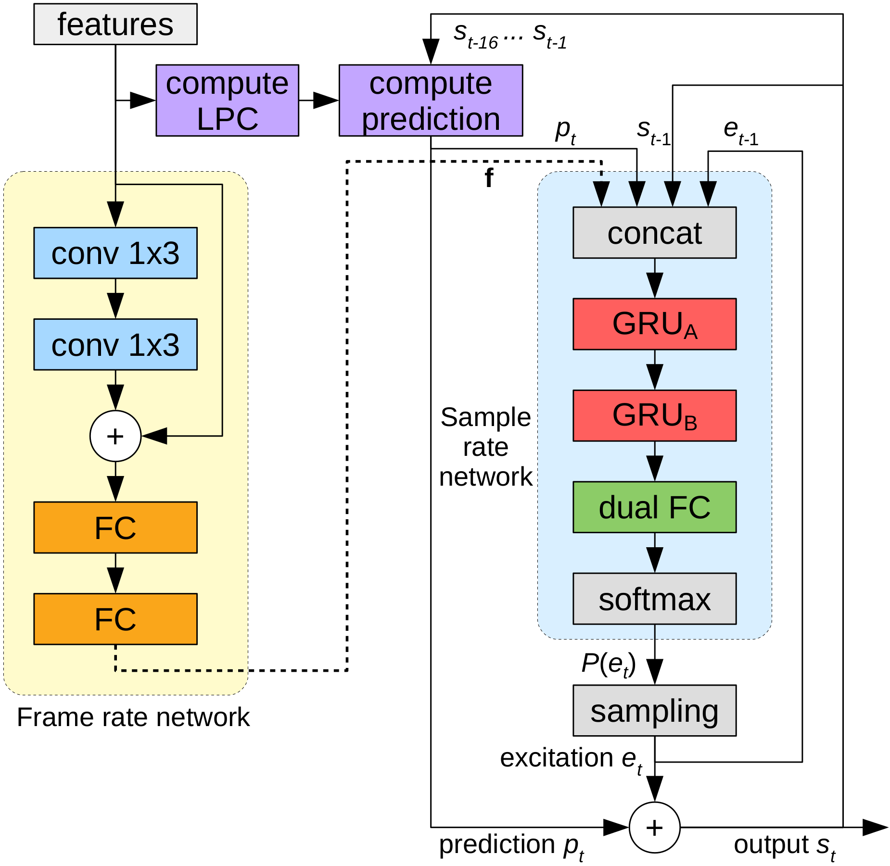

앞의 글에서 말한 것 같이, 딥러닝을 이용한 TTS 모델은 상당히 많다. 유명한 모델로는 Tacotron, Tacotron-2, Deep Voice (1, 2, 3), DC-TTS 등이 있는데, 모델별로 또 여러가지 구현체가 있다.

처음엔 Guided Attention을 적용하여 align이 상당히 잘 되는 것 같아 보이는 DC-TTS를 사용해봤다. 구현체는 [Kyubyong/dc_tts](https://github.com/Kyubyong/dc_tts)을 기반으로 한국어를 적용해서 썼다. 근데 잘 안되더라...

그래서 결국 무난한 Tacotron 또는 Tacotron-2를 쓰기로 했다. 구현체는 원래 Mozilla에서 Mozilla Common Voice 프로젝트의 일환으로 진행중인 [mozilla/TTS](https://github.com/mozilla/TTS)를 사용하려고 했으나, 한국어를 적용하니 죽어도 align이 안잡히더라... 나중에 Issue를 찾아보니 hyper parameter 중 r값을 1로 했을때 align이 안된다는 이슈가 올라와 있던데, 바꿔서 한번 시도해보는 것도 괜찮을 거 같다.

결정적으로 PyTorch가 익숙하지 않아서 그냥 익숙한 TensorFlow 구현체를 쓰기로 했다. 나중에 모바일 포팅할 때도 그게 편할테니...

---

또 하나 중요한 것은 알맞은 Vocoder를 찾는 것인데, 합성된 음성의 음질에 직접적인 영향을 준다. 위에서 나열한 TTS 모델들은 문장을 입력으로 받아 직접적으로 오디오 파형을 출력하는 것이 아닌 음성의 Feature들(주로 Mel Spectrogram)을 반환한다. Vocoder는 이를 받아서 실제 음성의 파형으로 변환하는 역할을 한다.

위에서 언급한 모델들과 [carpedm20/multi-speaker-tacotron-tensorflow](https://carpedm20.github.io/tacotron/) 등 대부분의 TTS 구현체들은 **Griffin-Lim**을 사용하는데, 이게 품질이 영 안좋다. 상용 TTS 엔진들은 별도의 상용 Vocoder를 사용하는 것 같다. 오픈소스로는 **WORLD Vocoder** 등이 있다.

> [WaveNet: A Generative Model for Raw Audio](https://deepmind.com/blog/wavenet-generative-model-raw-audio/)

그래서 구글의 DeepMind가 만든게 앞의 글에서 언급한 **WaveNet**이다. 딥러닝을 이용한 Vocoder, Neural Vocoder의 시대를 열었는데, 위의 링크에서 샘플을 들어보면 알겠지만 엄청난 퀄리티를 자랑한다.

그럼 WaveNet을 사용하는게 최선일까? 안타깝게도 WaveNet에는 치명적인 단점이 있는데, 엄청나게 느리다는 것이다. **1초의 음성을 생성하는데 1시간이 넘게 걸린다 (!)** 그것도 CPU도 아니고 GTX 1080Ti에서....

자, 이 포스트의 부제를 다시 보고 가자. `딥러닝을 이용한 모바일에서의 실시간 TTS 구현`이다. **실시간**이란 말은, 5초짜리 음성을 생성하는데 5초 이상 걸리면 안된다는 뜻이다. 모바일 환경에서!

구글도 WaveNet이 느리다는걸 알고 있어서, WaveNet을 공개한 이후 속도를 개선한 Parallel WaveNet, WaveRNN 등을 내놨고, NVIDIA는 WaveNet에 Generative Model인 Glow를 합친 WaveGlow를 공개했다. 다만 WaveRNN, WaveGlow는 여전히 모바일 CPU에서 사용하기에는 느리고, Parallel WaveNet은 학습이 더럽게 어렵다. 구글님은 저걸 경량화 해서 Google Assistant에 적용했지만, 오픈소스로는 아직 그정도 성능의 구현체는 없는 것 같다.

어쨌든 속도 문제에 초점을 둔 Neural Vocoder에 관심이 갔고, LPCNet과 FFTNet 둘중 하나 정도로 가닥을 잡았다. 하지만 FFTNet의 경우 Speaker-Dependent 하며, 오픈소스 구현체의 질이 LPCNet이 훨씬 좋아 LPCNet을 사용하기로 했다.

---

> [LPCNet: DSP-Boosted Neural Speech Synthesis](https://people.xiph.org/~jm/demo/lpcnet/)

**LPCNet**은 Opus 코덱의 주요 기여자 중 한명인 Jean-Marc Valin이 2018년 말에 제안한 모델로, WaveRNN을 기반으로 기존의 DSP 기술을 적용해 신경망을 경량화하여 속도를 높인 모델이다. 신경망에 모든 예측을 전가하는 대신, LPC Layer를 추가하여 현재 샘플과 함께 다음 샘플의 예측값을 같이 전달하여 뉴런의 개수를 효율적으로 줄인다.

J. M. Valin은 이걸 이용해서 1.6kb/s로 음성을 전송할 수 있는 코덱을 만들었다. Opus에도 적용할 생각을 하고 있는거 같던데, 역시 세상은 넓고 괴물은 많은 듯...

아무튼, LPCNet을 제안한 논문에 따르면 WaveRNN의 경량 버전이 대략 10 GFLOPS, FFTNet이 16 GFLOPS의 연산량을 요구하는데 비해 LPCNet은 2.8 GFLOPS 정도면 충분하다고 하다. iPhone 6의 Apple A8의 코어 한개로 가능한 연산량이다. (실제 적용해보니 6S는 되야 실시간 음성 합성이 가능했지만)

> [mozilla/LPCNet](https://github.com/mozilla/LPCNet)

LPCNet을 선택한 결정적인 이유는 훌륭한 오픈소스 구현체가 있기 때문이었다. 당시 J. M. Valin이 Mozilla 소속이었어서 Mozilla 하위에 프로젝트가 존재하는데, 무려 C 버전 소스가 있다. 거기에 SIMD를 이용한 최적화까지 적용되어 있다 (!) x86 AVX, AVX2/FMA에 이어 ARM NEON까지 지원하기 때문에 모바일에 포팅하기엔 이보다 수월할 수 없다.

게다가 나온지 1년도 안됐는데 벌써 선구자들이 Tacotron-2와 같이 사용하는 방법까지 개척해둬서, 대부분의 코딩을 날로 먹을 수 있었다.

[MlWoo/LPCNet](https://github.com/MlWoo/LPCNet), [alokprasad/LPCTron](https://github.com/alokprasad/LPCTron)의 구현을 참고해서 LPCNet과 Tacotron-2를 최신 버전으로 업데이트 하고 한국어 관련 코드를 추가했다.

학습은 파이썬에서 Keras를 사용하도록 구현되어 있는데, 학습 관련 코드가 지나치게 간결해서 그부분도 좀 손봤다.

다음 포스팅에서 본격적인 학습이 진행된다.
