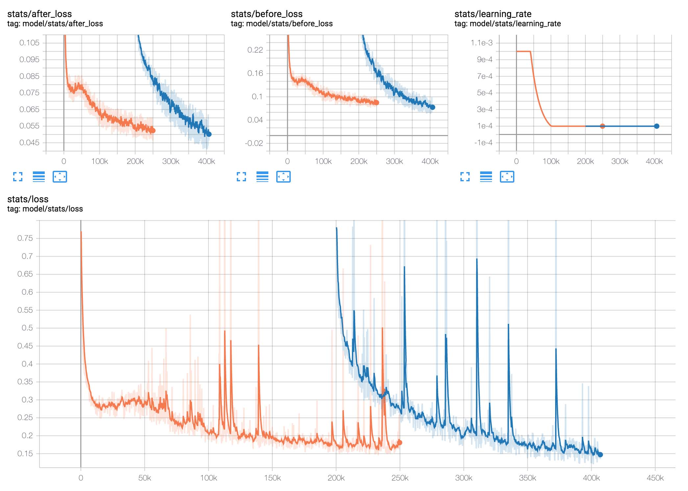
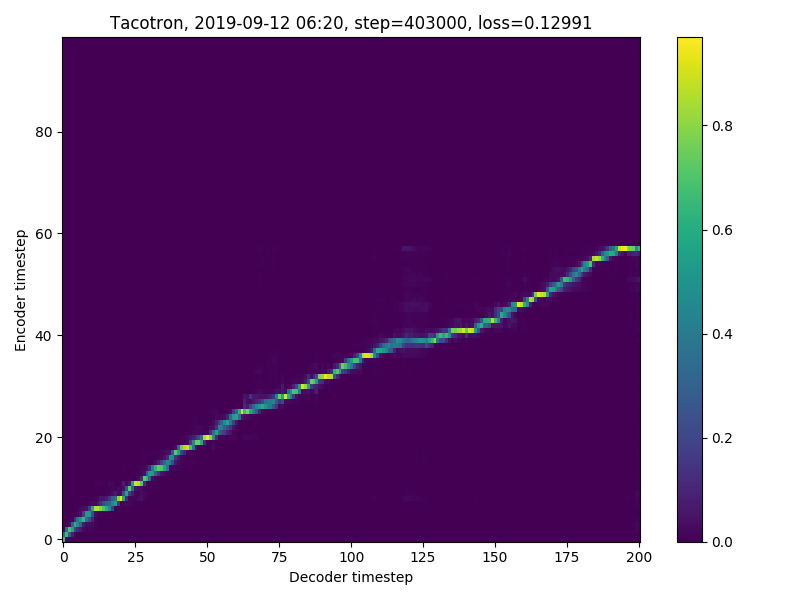

앞서 두 개의 포스팅에서 학습 데이터를 준비했고 모델로는 Tacotron-2와 LPCNet을 사용하기로 결정했다. 이제 본격적으로 학습을 해볼 차례다.

망할 애플이 macOS 10.14 Mojave 출시 1년이 넘었는데도 아직도 NVIDIA Web Driver를 지원해주지 않고 있어서, 지금 내 메인 컴퓨터에는 RX 580이 달려있다.

macOS 상에서 AMD 그래픽 카드를 통해 딥러닝 학습을 한다는 건 불가능 하기 때문에, Ubuntu를 설치해서 AMD ROCm을 이용할 생각이었다.

뭐... RX 580에 GPU 메모리도 나름 8GB나 달려있으니 될 거라고 생각했다. LPCNet 예상 학습 시간이 1달이 넘어가는 걸 보기 전까지는.

역시 AMD에서 딥러닝은 불가능하다는 걸 다시 깨달은 이후, 클라우드로 눈을 돌려 GCP를 쓰기로 했다. Tesla T4와 V100을 써봤는데 V100이 1.5배 정도 빨랐지만 가격이 2.5배였기 때문에 그냥 좀 느리더라도 T4를 썼다. 어쨌든 RX 580에서 돌리는 것보단 10배 이상 빠르더라...

나중에 RTX 2080Ti 달아서 딥러닝 머신을 하나 구축하던가 해야 될 거 같다.

---

> [Korean Single Speaker Speech Dataset](https://www.kaggle.com/bryanpark/korean-single-speaker-speech-dataset)

학습은 Tacotron-2와 LPCNet를 따로 진행해야 한다. 앞서 4+ 시간 분량의 아이유 음성 학습 데이터를 준비했지만 그걸로는 턱도 없이 모자라므로 비상업적 용도로 무료로 사용할 수 있는 12+ 시간 분량의 KSS Dataset을 같이 사용했다.

Multi-speaker 구현을 사용할까 고민했지만 일단 아이유 목소리만 만들면 장땡이므로 그냥 Single-speaker로 학습 후 Transfer Learning을 하기로 했다. 즉 별도의 코드 처리 없이 KSS 데이터셋으로 먼저 일정 분량 학습 후, 아이유 데이터셋으로 교체해서 이어서 학습을 진행했다.

Tacotron-2의 경우 KSS 데이터셋으로 250k Steps까지 학습했고, 200k부터 아이유 데이터셋으로 400k까지 학습했다. 학습에 소요된 시간은 KSS 4.5일 + IU 3.5일 = 총 8일이 소요되었다.

403k Step에서의 Alignment이다.

LPCNet은 KSS 데이터셋으로 100 Epoch까지 학습 후 아이유 데이터셋으로 120 Epoch까지 학습하였다. 학습에는 총 6일이 소요되었다.

---

DEMO
=====

여기까지 학습한 모델로 합성한 음성은 이렇다.

`audio: ./audio/demo-1.mp3`
_안녕하세요. 호텔 델루나에서 장만월 역을 맡은 아이유 입니다._

`audio: ./audio/demo-2.mp3`
_다음은 오늘 날씨입니다._

`audio: ./audio/demo-3.mp3`
_웹에서 다음 결과를 찾았습니다._

노이즈가 없진 않지만 그래도 꽤 들어줄 만한 음성을 합성하는 것을 들을 수 있다. 4+ 시간 정도의 데이터셋으로 얻어낸 결과치고는 만족한다. 물론 저건 쉬운 문장이라 잘 나오고 어려운 문장을 넣으면 많이 헤맨다. 후술하겠지만 그런 부분은 보완이 많이 필요할 것 같다.

다음 포스팅에선 이렇게 학습한 모델을 모바일에 포팅하는 과정이 이어진다.
