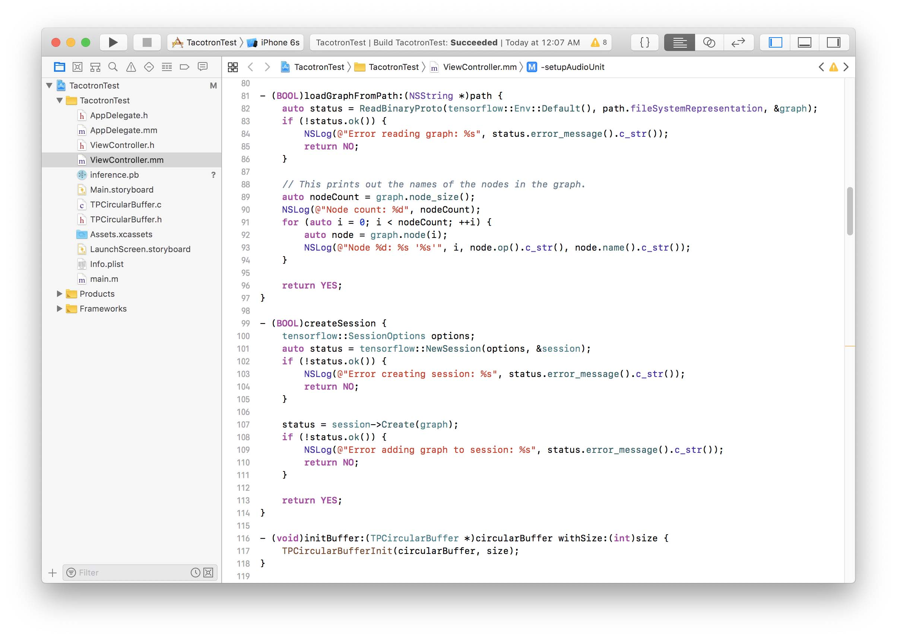
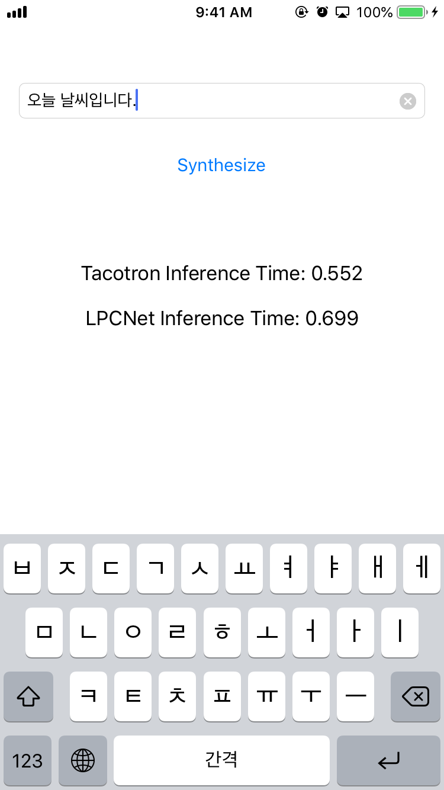

이제 모델은 완성했으니 모바일에 포팅할 차례이다. 내가 아이폰을 쓰기 때문에 아이폰을 대상으로 포팅했다.

TensorFlow 모델을 모바일로 포팅하는 가장 대표적인 방법은 모바일과 임베디드 용으로 나온 버전인 Tensorflow Lite을 사용하는 것이다. iOS만 대상으로 할 때는 Apple의 CoreML도 사용할 수 있다. CoreML을 사용하면 Metal을 통한 GPU 가속도 사용할 수 있기에, 요즘엔 이쪽이 선호되는 듯하다.

그래서 일단 TFLite나 CoreML을 사용하려고 했는데, 모델 변환이 안되더라.

TFLite/CoreML 둘 다 TensorFlow에서 제공하는 모든 Operation을 제공하지 않는다. 아무래도 모바일 환경이라 바이너리 크기도 줄여야 하고 성능에도 제약이 따르니 그런 거겠지. 문제는 Tacotron-2는 그런 Operation들을 아주 많이 사용한다.

따라서 Tacotron-2 모델을 TFLite나 CoreML로 포팅하려면 굉장히 많은 수정을 해야 한다.

그래서 그냥 TensorFlow를 통째로 포팅하는 방법을 쓰기로 했다.

---

> [TensorFlow Makefile](https://github.com/tensorflow/tensorflow/tree/master/tensorflow/contrib/makefile)

다행히도 이런 일이 종종 있어서인지 (TFLite 개발 이전엔 이 방법밖에 없기도 했고) TensorFlow는 모바일용 정적 라이브러리 빌드 방법도 제공한다. iOS, macOS, Android, Raspberry-Pi 등을 타깃으로 빌드할 수 있다. iOS의 경우 친절하게 [예시](https://github.com/tensorflow/tensorflow/tree/master/tensorflow/examples/ios)까지 제공한다.

근데 이렇게 컴파일 하더라도 Tacotron-2 모델을 로딩하면 에러가 난다. 위와 마찬가지로 기본적으로 모바일 빌드에는 모든 Operation이 포함되지 않기 때문인데, 다행히 TFLite는 다르게 지원은 하지만 용량 등의 이유로 빼놓은 거기 때문에 빌드 옵션에서 넣어주기만 하면 된다.

모델을 로드할 때 없는 Operation을 출력해주기 때문에 해당 Operation들을 `tensorflow/contrib/makefile/tf_op_files.txt` 파일을 수정해서 넣어주면 된다.

이 상태로 iOS에 컴파일해서 집어넣으면 `EXC_BAD_INSTRUCTION`이 떴는데, TensorFlow GitHub를 찾아보니 관련 [issue](https://github.com/tensorflow/tensorflow/issues/29627)가 있었다. 이를 참고해서 `tensorflow/core/platform/profile_utils/cpu_utils.h` 파일을 수정해 assembler timing을 비활성화하고 더미 클럭을 사용하는 것으로 해결했다. 완벽한 해결책은 아닌 것 같은데 일단 잘 돌아가니 뭐...

LPCNet은 학습한 H5 모델을 같이 있는 스크립트로 C 소스로 변환한 뒤 정적 라이브러리로 컴파일했다.

---

다음은 코딩 시간이다. TensorFlow는 C++ 인터페이스만 제공하기 때문에 Swift 같은 건 못쓴다. Objective-C++을 사용하여 코딩했다. 오랜만에 하려니 적응 안 되더라...

이쁘게 코드 정리하면 좋겠다만, 어차피 이건 테스트 용으로만 쓸거니 모든 코드를 ViewController에 때려 박았다.

간단하게 UI도 만들어서 넣어줬다.

---

DEMO
=====

<iframe width="560" height="996" src="https://www.youtube.com/embed/gH7771yCgwI" frameborder="0" allow="accelerometer; autoplay; encrypted-media; gyroscope; picture-in-picture" allowfullscreen></iframe>

