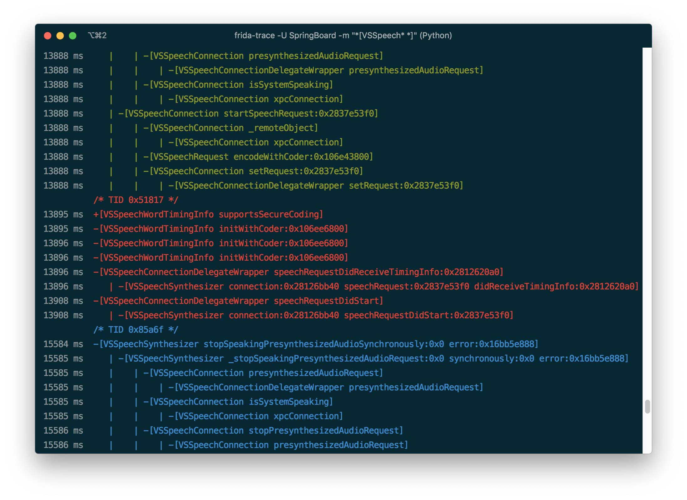
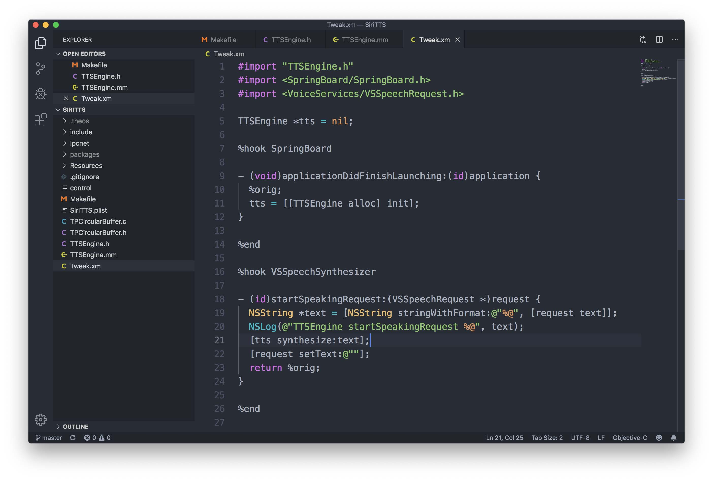
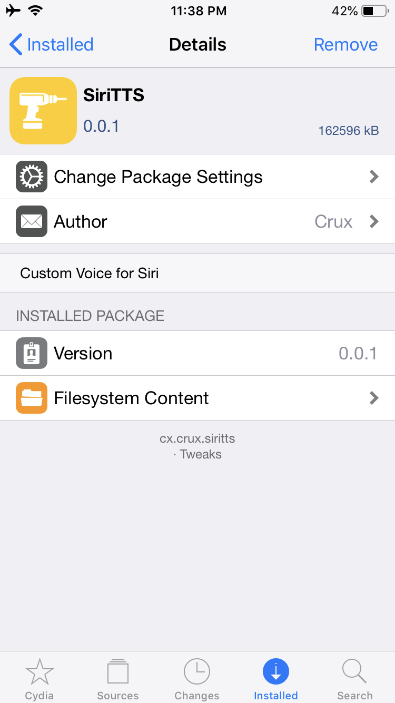

자 이제 대망의 마지막 단계이다.

딥러닝을 이용한 TTS 모델도 만들었고 모바일에서 포팅까지 끝냈으니 이제 남은 일은 이 포스팅의 목적인 Siri의 TTS 엔진을 내가 만든 새 TTS 엔진으로 교체하는 것이다.

왜 하필 멍청한 Siri냐면, 내가 앱등이라는 이유도 꽤 크겠지만 일단 Objective-C로 되어있기 때문에 Hooking이 매우 쉽다. 그리고 어차피 다 비슷비슷하기 때문에 아무거나 하나 일단 해두면 나머지는 적용하기 쉽다. (안드로이드로 옮긴다든지 그런 거만 아니면...)

이후의 과정은 모두 탈옥된 단말에서 진행되었다. iOS 특성상 탈옥 없이는 시스템을 못 건드리니까.. Siri가 아닌 다른 앱이라면 탈옥 없이도 가능할 수도 있다.

사용된 iOS 버전은 12.4이고 iPhone 6S와 7에서 작업했다.

---

먼저 Siri를 분석해서 어느 메소드가 TTS 엔진을 호출하는지 알아내야 한다. 역분석에는 [Frida](https://www.frida.re/)를 사용했다.

`frida-trace` 명령어를 이용해 후킹할 메소드 명을 걸면 메소드 콜을 확인할 수 있다. `class-dump`로 해당 Framework의 헤더 파일을 얻어서 참조하며 분석하면 된다.

분석 결과 TTS 호출은 `VoiceServices.framework`의 `[VSSpeechSynthesizer startSpeakingRequest]` 메소드를 통해 호출되고, `AssistantUI`의 `[AFUISpeechSynthesis _handleText:completion:]` 메소드를 거쳐 시스템 데몬인 `voiced`과 `NSXPCConnection`을 통해 통신한다. 실제 음성 합성은 voiced에서 진행되는 것으로 보인다.

TTS 특성상 중간에 호출이 취소되는 등 꽤나 많은 예외 상황이 있을 것으로 보이지만, 일단 최대한 간단하게 분석해서 원하는 메소드만 얻어냈다.

---

Hooking할 메소드 명을 얻었으니 [Theos](https://github.com/theos/theos)를 이용해서 MobileSubstrate용 Tweak을 만들면 된다. TTS 엔진 구현은 이전 포스팅에서 다 했으니 그대로 옮기면 된다.

...라고 생각했는데, Xcode에서 알아서 다 잡아줬던 컴파일러나 Linker 설정을 전부 Makefile로 옮겨야 해서 좀 헤맸다. 기본적으로 theos가 Objective-C만 사용하도록 되어있어서, Objective-C++로 작성한 코드를 사용하기 위해 옵션을 고쳐줘야 했다.

하는 김에 전에 ViewController에 전부 때려 박아놨던 코드도 좀 정리했다.

위에서 찾아낸 `[VSSpeechSynthesizer startSpeakingRequest]` 메소드를 후킹해서 새로 만든 TTS 엔진을 호출하도록 고쳐주면 끝.

빌드하면 이렇게 설치 가능한 deb 파일이 생성된다.

총 설치 용량은 160MB 정도 되는데, 꽤 크다. TensorFlow 바이너리가 40MB 정도 되며 LPCNet 바이너리가 20MB, Tacotron-2 모델이 100MB 가량 차지한다.

줄이려면 더 줄일 수 있겠지만 일단 이대로 쓰는 걸로...

---

DEMO
=====

<iframe width="560" height="315" src="https://www.youtube.com/embed/O1HIPrpNkUY" frameborder="0" allow="accelerometer; autoplay; encrypted-media; gyroscope; picture-in-picture" allowfullscreen></iframe>

---

TODO
=====

위의 데모를 보면 알겠지만 아이유 목소리 같으면서도 많이 부자연스럽다. 아직 딱 데모 동영상 찍을 정도의 수준이다. 앞서 말했듯이 쉬운 문장들은 그래도 비슷하게 읽지만 조금이라도 문장이 길어지거나 어려운 단어가 나오면 음성이 깨져버린다.

아래는 내가 생각한 개선 사항들이다.

**1. 학습 데이터 개선**

역시 딥러닝에서 가장 중요한 건 학습 데이터라는 걸 절실히 느낄 수 있었다. 4+ 시간의 데이터셋으로 얻어낸 결과 치고는 만족하지만 더 큰 데이터셋이 있다면 더 자연스러운 결과를 얻어낼 수 있지 않을까 싶다.

자연스러운 결과를 얻으려면 최소 10+ 시간 이상의 데이터는 있어야 할 것 같다. 노가다를 얼마나 해야 하는 것인가...

그리고 학습 데이터의 품질 자체도 중요해 보인다. 문장 마무리가 깔끔하게 되지 않고 흐려지는 문장들이 좀 있었는데 그런 것들도 같이 학습이 되어 버렸다.

**2. Multi-Speaker 구현**

이건 사실 필수적이지 않을 거라고 생각해서 이번엔 적용하지 않았다. 어차피 아이유 음성만 만들 거니까.

하지만 학습 시 transfer 하는 과정에서 갑자기 loss가 초기 수준으로 치솟는 그래프를 경험했다. DC-TTS의 경우 Transfer Learning을 하더라도 크게 loss가 바뀌지 않았는데, 아마 Guided Attention이 적용되어서 그렇지 않았나 싶다.

동일한 방법을 Tacotron-2에 적용했더니 학습 상태가 초기 상태와 비슷하게 돌아가버려서 원래 50k 정도만 추가적으로 학습하려 했는데 transfer 이전과 동일한 loss를 얻기 위해 200k를 더 학습해야 했다.

아마 Multi-Speaker 구현 시 이런 부분이 좀 나아지지 않을까 싶다.

그리고 Multi-Speaker를 적용했을 때의 또 다른 이점이 있는데, 바로 KSS 데이터셋 이외의 공개 데이터셋도 활용이 가능하다는 것이다. 국립국어원에서 제공하는 120+ 시간 분량의 [NIKL](https://ithub.korean.go.kr/user/corpus/referenceManager.do) 데이터셋이나 [AI Hub](http://www.aihub.or.kr/content/552)에서 제공하는 1000+ 시간 (!) 분량의 한국어 음성 데이터셋 등을 활용할 수 있어진다.

**3. 한국어 처리 개선**

현재 Tacotron-2에 추가한 한국어 구현은 _carpedm20_의 구현에 기반하고 있는데, 단순히 한글 이외의 문자를 한글로 치환하거나 제거하고 각 글자를 자모 단위로 쪼개서 Symbol에 대응하도록 변환하는 구조이다.

그렇게 해도 학습 데이터가 충분하다면 쓸만한 음성을 얻을 수 있는 것으로 보이나, 제한된 데이터로 학습하기 위해서는 한국어 처리 로직을 개선할 필요가 있어 보인다.

특히 생성된 음성을 들어보면 한글 종성 부분을 제대로 발음하지 못하는 현상이 보이는데, 분리된 자모 중 초성과 종성의 발음이 다른 것을 충분히 학습하지 못해서 일어나는 것으로 보인다. 초성에 있을 때는 발음 되지 않는 'ㅇ'를 종성에 있을 때도 발음하지 않는 등의 문제가 있다.

일단 가장 먼저 생각나는 해결책으로는 세벌식 키보드처럼 초성과 종성에 각각 다른 Symbol을 배정하는 것이다. 이렇게 하면 초성과 종성의 발음을 구분하지 못하는 문제는 확실히 해결될 것으로 보인다. 다만 더 많은 학습 데이터가 필요하겠지.

또는 어차피 한국어 받침은 'ㄱ, ㄴ, ㄷ, ㄹ, ㅁ, ㅂ, ㅇ' 7가지만 발음되니 표준 발음법에 맞춰서 모든 종성을 저 7가지로 치환해버리는 방법도 있겠다.

[mozilla/TTS](https://github.com/mozilla/TTS) 구현체에서는 [Phonemizer](https://github.com/bootphon/phonemizer)를 이용해서 문자열(_graphemes_)을 발음열(_phonemes_)로 변환하여 학습하는 방법을 사용했다. Phonemizer가 한국어를 지원하지 않는다는 게 문제일 뿐. 한국어를 지원하는 [KoG2P](https://github.com/scarletcho/KoG2P), [g2pK](https://github.com/Kyubyong/g2pK) 같은 라이브러리도 있지만, 파이썬만 지원하기 때문에 Objective-C로 포팅해야 한다.

**4. 모델 튜닝**

모델의 Hyperparameter를 수정하면 더 좋은 결과를 얻어낼 수 있을 것 같지만 클라우드에서 값을 찾아가며 튜닝하기엔 어려움이 있어 많은 조합을 시도해 보진 못했다. 앞서 포스팅에서 살짝 말했지만, Tacotron의 r값을 조정하거나 레이어 depth를 조정해가며 최적값을 찾으면 성능을 좀 더 올릴 수 있을 것이다. 이건 나중에 딥러닝 머신 마련하면 해보는 걸로...

**5. 코드 개선**

코드 상태를 보면 좀 심각하다. 귀찮아서 기존 Siri의 TTS 엔진을 호출하는 로직을 아예 없애지 않고 그냥 빈 문자열을 넘겨줘 버리는 트릭으로 처리했고, 그 외에도 고칠 부분이 넘쳐난다.

Siri에서 내가 제일 많이 사용하는 기능은 **시간 알림 기능**인데, (아침에 침대에서 _"헤이 시리, 지금 몇 시야?"_ 하는 것만큼 편한게 없다.) 데모에서는 빠졌다.

숫자를 문자로 바꾸는 기능은 넣어놨는데 (_ex) 1,534 => 천오백삼십사_) Siri는 시간을 _11시 30분, 11:30_ 이런 식으로 표시한다. _열한시 삼십분_ 으로 읽어야하는데 앞의 표기는 _십일시 삼십분_ 으로 읽어버리고 뒤의 표기는 그냥 _십일 삼십_ 이런 식으로 읽는다.

이렇게 귀찮아서 걍 냅둔 부분이 좀 많은데 단순 데모용을 넘어서 실제 사용하려면 이런 부분도 개선이 필요하다.

바이너리 크기도 지금은 상당히 큰데 최적화를 통해서 더 줄일 수 있을 것이다.

**5. 다른 앱에 적용**

<blockquote class="twitter-tweet">
ㅋㅋㅋㅋ존댓말 쓸 가치도 없어서 명령하는 만월 네비게이션ㅋㅌㅋㅋㅋㅋ  매주 [토일] 밤 9시 방송<a href="https://twitter.com/hashtag/tvN?src=hash&amp;ref_src=twsrc%5Etfw">#tvN</a> <a href="https://twitter.com/hashtag/%ED%86%A0%EC%9D%BC%EB%93%9C%EB%9D%BC%EB%A7%88?src=hash&amp;ref_src=twsrc%5Etfw">#토일드라마</a> <a href="https://twitter.com/hashtag/%ED%98%B8%ED%85%94%EB%8D%B8%EB%A3%A8%EB%82%98?src=hash&amp;ref_src=twsrc%5Etfw">#호텔델루나</a> <a href="https://twitter.com/hashtag/%EC%9D%B4%EC%A7%80%EC%9D%80?src=hash&amp;ref_src=twsrc%5Etfw">#이지은</a> <a href="https://twitter.com/hashtag/%EC%97%AC%EC%A7%84%EA%B5%AC?src=hash&amp;ref_src=twsrc%5Etfw">#여진구</a> <a href="https://t.co/2v4oWygV9K">pic.twitter.com/2v4oWygV9K</a>
&mdash; tvN 드라마 (@CJnDrama) <a href="https://twitter.com/CJnDrama/status/1157950429621178368?ref_src=twsrc%5Etfw">August 4, 2019</a></blockquote>

이렇게 만든 TTS 엔진을 T Map 같은 네비게이션 앱에 적용하면 **만월 네비게이션**도 만들 수 있다!

