잊을만 하면 오는 팬클럽 키트가 왔다. 

이번 8기 키트에는 보이스 디바이스라는게 들어있는데, 동봉된 보이스 카드를 끼우면 그 카드에 해당하는 아이유 목소리가 재생된다. 어린이 장난감 응용해서 만든 듯.

언제 고장날지도 모르고 이거 듣겠다고 카드 꺼내서 끼우기는 귀찮으니까 녹음을 해보자.

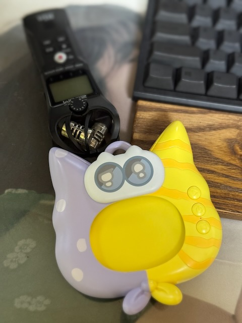

당연히 제일 먼저 생각나는건 이런 식으로 녹음기로 직접 녹음하는건데, 음질이 심하게 떨어질 수 밖에 없다.

3.5mm 단자 같은게 달려있으면 쉽게 AUX로 녹음이 되겠지만, 아쉽게도 그런거 없이 내장 스피커만 달려있다.

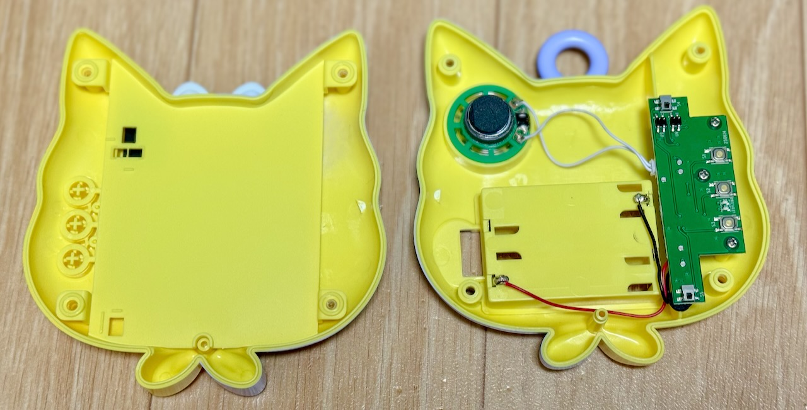

일단 뚜껑을 따보면 생각보다 간단한 구조로 되어있다.

전원은 1.5V AAA 배터리 3개니까 4.5V고, 카드 삽입/제거 인식을 위한 리미트 스위치 2개, 바코드 인식을 위한 IR 센서 2개, MCU, ROM, 내장 스피커로 구성되어 있다.

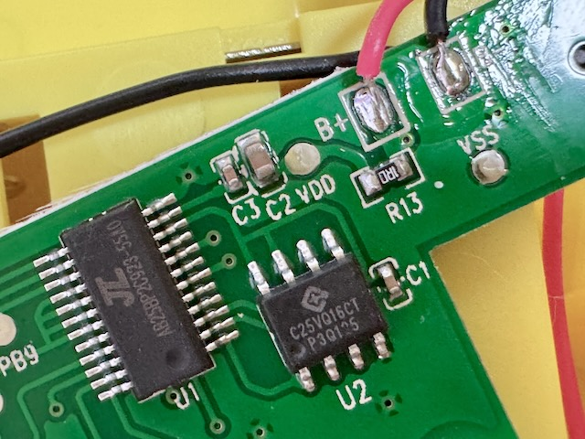

메인 MCU로 보이는 IC는 `AB25BP2C923-55A0`라고 레이블 되어있고, 바로 밑에 2MB NOR Flash인 `GD25VQ16CTIG`가 있다. 따로 전원부 IC 같은거도 없고 저게 끝이다.

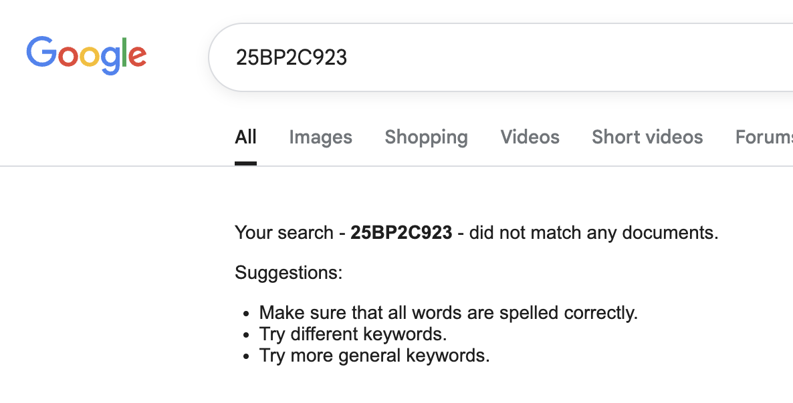

메인 IC는 검색해도 아무 자료도 안나온다. Pinout이라도 알면 편한데...

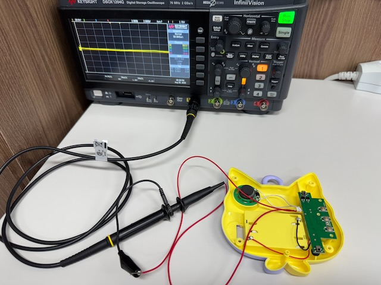

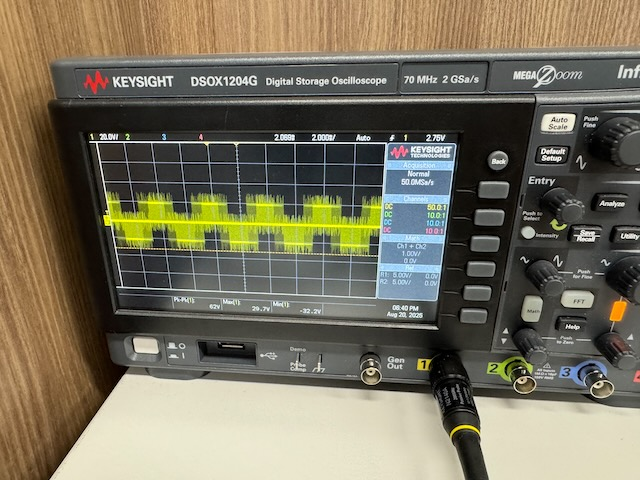

일단 스피커 라인을 오실로스코프에 물려서 찍어보면 30V 이상이 찍히는걸 확인할 수 있다.

IC에 스피커 앰프가 내장된거라 이 출력 그대로 AUX에 물리면 고장난다.

  

저항으로 간단한 분압기를 만들어서 달아주자.

대충 40:1 정도로 감쇠해주면 될거 같아서 20k옴이랑 470옴 저항을 썼는데, 실제로 해보니까 조금 더 높여도 될 듯.. 가변저항 달아서 조정하는거도 방법일 것 같다.

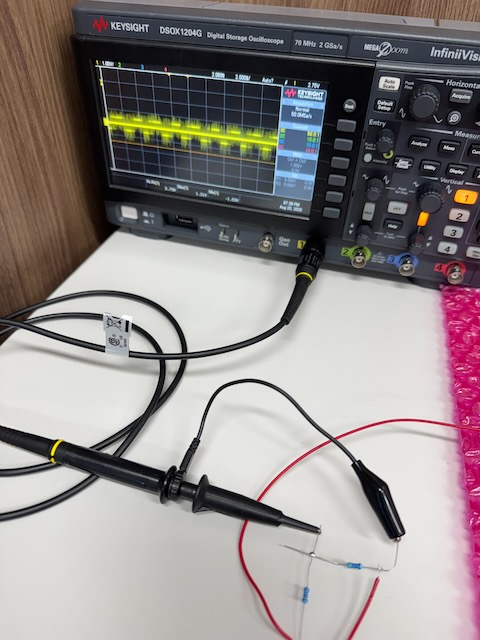

저항달고 다시 재보면 1.5V 정도로 줄어든걸 볼 수 있다. 이정도면 AUX로 물려도 된다.

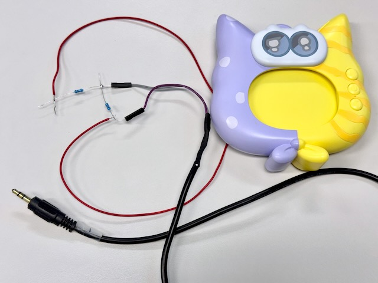

굴러다니는 3.5mm 케이블을 잘라서 달아준다.

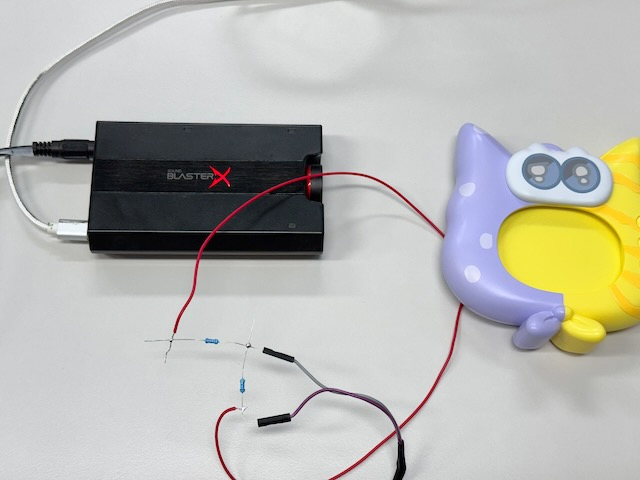

그리고 사운드 카드의 Line-in 입력에 물려주면 된다.

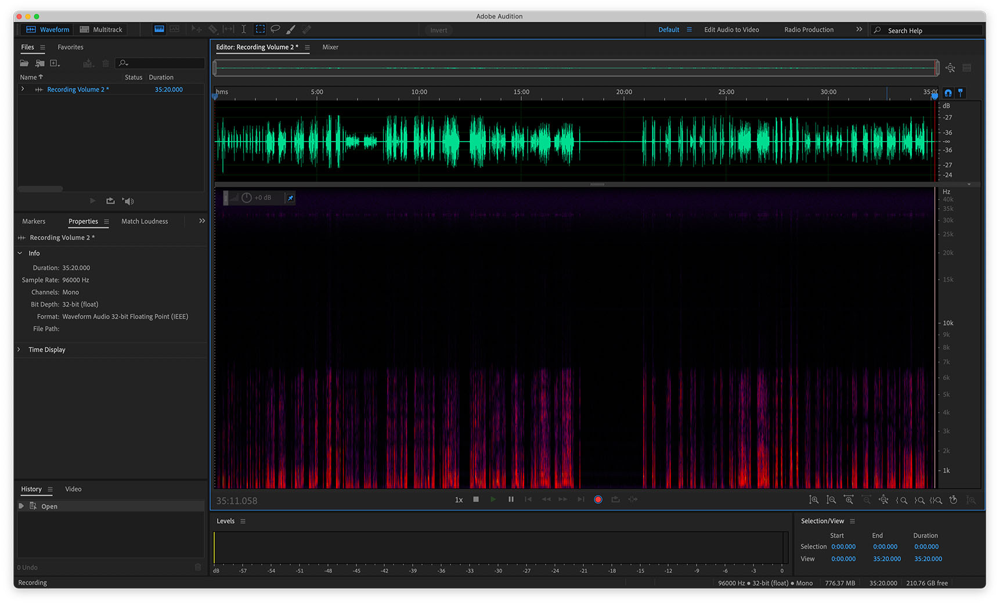

이제 [Audition](https://www.adobe.com/products/audition.html)이나 [Audacity](https://www.audacityteam.org/) 같은 녹음 프로그램으로 깔끔하게 녹음할 수 있다.

녹음할 때는 보이스 디바이스 볼륨 키를 눌러서 볼륨 1이나 2로 녹음하는 걸 권장한다. 볼륨 3은 깨진다.

`audio: ./audio/line.m4a`
_Line-in_

이렇게 녹음된다. 별도의 노이즈 제거 없이 Gain만 조정한 결과이다.

`audio: ./audio/h1n.m4a`
_Zoom H1n_

비교용으로 Zoom H1n 녹음기로 녹음된 파일이다.

확실히 원본에 가까운 음질로 녹음되는걸 확인할 수 있다.

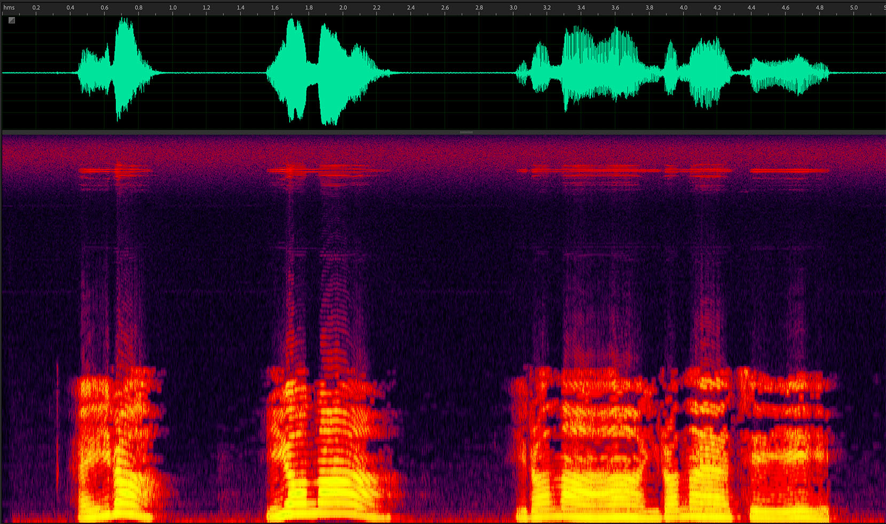

근데 원본에 _가까운_ 음질이라는거지 원본은 아니다. 스펙트로그램을 봐도 노이즈가 좀 보인다. 원본을 추출할 수는 없을까?

다음 글에서 그 개뻘짓이 이어진다...
