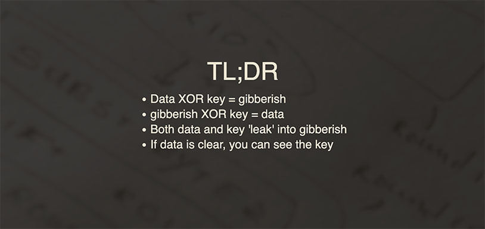

[이전 포스팅](/iu-voice-device-1/)에서는 8기 키트에 포함된 보이스 디바이스 음성을 AUX로 녹음했었다.

이렇게만 해도 녹음기나 스마트폰으로 녹음하는 것보다 훨씬 원본에 가까운 음질로 녹음이 가능하다.

다만 원본에 _가까운_ 음질일 뿐이고 노이즈가 좀 있다. 여기서 대충 만족했어야하는데... 이왕이면 원본이 좋지 않겠냐는 생각에 결국 대삽질을 시작하고 만다.


지난번에 설명했던 것처럼 메인 MCU로 추정되는 `AB25BP2C923-55A0`라고 레이블된 U1 IC는 검색해도 아무런 자료가 나오지 않는다.

다행히 그 밑에 있는 U2 IC는 검색해보니 [GD25VQ16CTIG](https://www.mouser.com/ProductDetail/GigaDevice/GD25VQ16CTIG?qs=RcG8xmE7yp2GCVCBfgvf%252BA%3D%3D) 비슷한 IC인거 같고, [데이터시트](https://www.mouser.com/datasheet/2/870/gd25vq16c_v1.6_20190226-1668249.pdf)에 따르면 2MB짜리 NOR Flash다.

혹시 플래시에 오디오가 PCM 형태로 저장이 되어있으면 어차피 바이트 단위로 저장이 되기 때문에 그냥 덤프뜨고 대충 변환해도 읽힌다.

근데 2MB 용량으로는 16000Hz 16비트 모노 오디오 기준으로 1분 정도밖에 안들어간다.

이전 포스팅에서 녹음하면서 확인한대로면 전체 음성 길이는 거의 10분인데, 그럼 어떤 형태든 압축되어서 저장되어있단 얘기다.

일단 모르겠으니 덤프부터 떠보자.


플럭스 발라주고 열풍기로 조지면,


요렇게 뗄 수 있다.


덤프뜨려면 Programmer에 물려야하니까 Breakout 보드에 다시 붙여주자.


그리고 이렇게 Programmer에 물려주면,


덤프를 뜰 수 있다.

2MB 플래시가 맞다. 그럼 용량 상 PCM일 가능성은 거의 없는데, 그래도 혹시 모르니까 변환해서 열어보자.

```bash
sox -t raw -r 16000 -b 16 -c 1 -L -e signed-integer dump.bin dump.wav
```

이런 식으로 덤프에 PCM 포맷이 포함되어있다고 가정하고 WAV 파일로 변환할 수 있다.


왕창 깨지는거 봐서 어림도 없다.

결국 뭔가 압축 포맷으로 저장되어있다는 얘긴데 이제 관련 정보가 아무것도 없는 상태에서 뭐인지 찾아야된다.


MP3나 AAC 같은 known 포맷이면 `binwalk` 돌리면 뭐라도 나올텐데 아무것도 안나온다.


`strings` 돌려서 텍스트를 찾아봐도 잔뜩 깨져서 나온다..


Hex 에디터로 열어서 보니까 뭔가 흥미로운게 보인다.

`SPI 0_3_0 BOOT_TYPE`으로 검색을 해보니 2개월 전에 올라온 [레딧 글](https://www.reddit.com/r/hardwarehacking/comments/1la3n5j/hacking_the_weird_dancing_cactus_toy/) 하나가 나왔다.


**Dancing Cactus**(춤추는 선인장?)라는 장난감을 분해해서 덤프 뜬 것 같은데, 보이스 디바이스랑 비슷하게 노래가 나오는 장난감인 것 같다. 그리고 MCU가 `JieLi AB21BP0K098-42A0`이라는데, 보이스 디바이스의 `AB25BP2C923-55A0`과 **매우 비슷하다!**

처음 바이트가 ASCII 문자열 `"0.01"`로 시작한다는 점을 제외하면, `"SH54"`, `"SPI 0_3_0 BOOT_TYPE"` 문자열이 포함되어 있다는 것도 매우 비슷하다. 이러면 보이스 디바이스의 메인 MCU도 `JieLi`라는 같은 제조사 제품이라고 추정해 볼 수 있다.


검색해보니 [JieLi](https://www.zh-jieli.com/)는 오디오랑 블루투스 쪽 MCU를 만드는 중국 회사로 보인다. 근데 로고가 익숙하다?


맞다. 메인 MCU로 추정되는 IC에 있던 로고다. 이러면 `JieLi` 사의 IC인게 확실해졌다. 로고가 파이π 인줄 알았는데 JL 이었다...

다시 레딧 글로 돌아가서, 아래 부분을 보면 이런 내용이 있다.

> The layout of this cactus is very similar to [Leo's](https://leo.leung.xyz/wiki/Dancing_Cactus) teardown, but in my case, there are **no WAV headers** in the flash data. I suspect the audio is **encrypted**, possibly in a similar way to the [Buddha Flower](https://hackaday.com/2022/04/14/remoticon-2021-jeroen-domburg-sprite_tm-hacks-the-buddah-flower/).

WAV 파일 헤더가 안보여서 암호화 되어있는거 같다는 불길한 내용이 보인다. 언급된 [Leo's teardown](https://leo.leung.xyz/wiki/Dancing_Cactus)을 들어가보면 암호화 되지 않은 경우 아래처럼 WAV 파일 헤더가 보인다는거 같은데, 내가 덤프뜬 파일에는 WAV 헤더라곤 전혀 보이지 않고 애초에 우리 보이스 디바이스는 용량 크기 상 WAV 파일일 수가 없다.

```
000bb000: 41c6 1000 00ff ffff 3401 0000 1801 0000  A.......4.......
000bb010: 5741 5604 77ff ffff 1758 888b 8080 8808  WAV.w....X......
000bb020: 0088 0088 081c 9100 8088 11ab 12da 1270  ...............p
--
000bc000: 8daa 1000 00ff ffff 8407 0000 1901 0000  ................
000bc010: 5741 5604 ffff ffff f118 0815 0880 0880  WAV.............
000bc020: 0808 8008 091d a281 9880 8119 bbf8 291a  ..............).
--
000bd000: 1998 1000 00ff ffff f400 0000 1a01 0000  ................
000bd010: 5741 5604 7fff 77ff 41bc 862a 8080 8088  WAV...w.A..*....
000bd020: 0088 0808 081b a101 8908 a805 8802 ab19  ................
```

그럼 뭔가 암호화 되어있는게 맞다는 소리인데... 일단 조금 더 찾아보자.


같이 언급된 [Buddha Flower](https://hackaday.com/2022/04/14/remoticon-2021-jeroen-domburg-sprite_tm-hacks-the-buddah-flower/)는 위에 사진처럼 생겨먹은 장난감이고, 마찬가지로 버튼을 누르면 노래가 나온다는거 같다.

Hackday 글을 들어가보면 Remoticon 2021이라는 컨퍼런스에서 Jeroen Domburg (Sprite_tm)라는 아저씨가 Buddha Flower 역분석한걸 발표한 것 같고, 아래 유튜브 영상과 [발표자료](http://meuk.spritesserver.nl/had-buddha/) 링크가 있다.

<iframe width="560" height="315" src="https://www.youtube.com/embed/5ZtVT8V1Xy0" title="YouTube video player" frameborder="0" allow="accelerometer; autoplay; clipboard-write; encrypted-media; gyroscope; picture-in-picture; web-share" referrerpolicy="strict-origin-when-cross-origin" allowfullscreen></iframe>


무려 XOR 암호화(...)란다.




Jeroen Domburg 아저씨가 친절하게 설명해주듯이 XOR은 plaintext가 공백 문자열이면 key가 그대로 ciphertext에 노출되고, 같은 key를 여러번 재사용해도 ciphertext에 키가 leak 된다.

[https://github.com/Spritetm/unbuddha](https://github.com/Spritetm/unbuddha)

친절하게 복호화 코드까지 있다.

문제는 저걸 복호화 한다고 바로 음원 파일이 튀어나오는게 아니고 뭔가 내부적인 File System 구조가 있다는 건데, 다행히 이미 많은 선구자들이 JeiLi 칩을 씹고 뜯고 맛보고 즐기며 자료를 정리해두었다.

[https://github.com/kagaimiq/jielie](https://github.com/kagaimiq/jielie)

위의 GitHub Repo에 JieLi 칩에 대해서 매우 상세하게 설명되어 있다. `AB25BP2C923-55A0`이라는 괴랄하게 생겨먹은 [IC 마킹 해석법](https://github.com/kagaimiq/jielie/blob/main/chips/chip-marks.md)부터 시작해서, [암호화 방식](https://github.com/kagaimiq/jielie/blob/main/misc/cipher.md), 그리고 우리가 필요한 [펌웨어 구조](https://github.com/kagaimiq/jielie/blob/main/datafmt/newfw.md)까지 필요한 대부분의 정보들이 정리되어 있는 노다지다.

[https://github.com/kagaimiq/jl-misctools](https://github.com/kagaimiq/jl-misctools)

물론 저거 보고 구현하려면 매우매우매우 귀찮겠지만, 놀랍게도 코드까지 같이 있었다.


우리가 필요한 [언패커](https://github.com/kagaimiq/jl-misctools/blob/main/firmware/fwunpack_newfw.py)도 있는데, 이거 작년 10월에 올라왔다. 보이스 디바이스가 7기 키트였으면 이거 내가 직접 짰어야된다는 소린데...

아무튼 [해당 Repo를 읽어보니까](https://github.com/kagaimiq/jl-misctools/blob/main/firmware/README.md) 아예 암호화 키가 `chipkey.bin`이라는 파일 안에 박혀있어서 따로 bruteforce 돌릴 필요도 없단다. 우리는 그냥 `fwunpack_newfw.py`만 실행해주면 된다.


실행하면 깔끔하게 복호화된 decrypted.bin 파일과 함께 파일 시스템 내 폴더와 파일이 언팩된다.

근데 저기 음원 파일은 안보이는데, 1.1MB짜리 dir_song 파일이 이름부터가 음원이 들어있을 것 같다.


열어보면 이렇게 `*.f1a` 파일들이 포함된 파일처럼 보인다. `f1a`는 무슨 듣보잡 파일인가싶지만, 일단 넘어가고 저 파일을 언팩하는 코드 정도는 직접 짜주자. `JLFS2`라고 부르는 파일시스템 구조인거 같으니까 기존에 있던 코드를 조금만 고치면 된다.

[https://github.com/crux153/jl-misctools](https://github.com/crux153/jl-misctools)

Fork 떠서 해당 코드를 올려두었다.

먼저 dir_song 파일을 언팩하는 코드를 [`fwunpack_newfw_decode_file.py`](https://github.com/crux153/jl-misctools/blob/main/firmware/fwunpack_newfw_decode_file.py)로 만들었는데, 만들다보니 그냥 [`fwunpack_newfw.py`](https://github.com/crux153/jl-misctools/blob/main/firmware/fwunpack_newfw.py)만 돌려도 자동으로 풀리게 수정했다.

```bash
git clone https://github.com/crux153/jl-misctools.git
cd jl-misctools
pip install -r requirements.txt
python3 firmware/fwunpack_newfw.py dump.bin
```

위의 코드를 실행하면 아래처럼 깔끔하게 `*.f1a` 파일들이 언팩된다.


문제는 `f1a`가 음원 파일 같긴 한데 대체 뭔 포맷이냐는 건데, 다행히 Jeroen Domburg씨의 발표 뒷부분에 관련 내용이 있다.


그러니까, `f1a`는 `WMA (Windows Media Audio)` 인코더를 갖다가 이리저리 고쳐서 만든 자체 포맷이라는거다. 이 뭔...

JieLi에서 제공하는 공식 SDK에 [f1a 디코더 함수](https://github.com/Jieli-Tech/fw-AD15N/blob/79a49f5d55781f4891b48d25c8e23a11c3b8b14d/sdk/include_lib/decoder/list/f1a_api.h)가 있긴 한데, 헤더만 있다.


JieLi 공식 SDK [README](https://github.com/Jieli-Tech/fw-AD15N/blob/main/README-en.md)에 오디오 변환 프로그램 어쩌고가 있단다. 중국 회사답게 [바이두 클라우드 링크](https://pan.baidu.com/s/1f5pK7ZaBNnvbflD-7R22zA)다... 다운 받아 보자.

`杰理通用音频工具.zip` 파일을 받아서 압축 풀고 `杰理通用音频工具\AD音频_转换工具\AD音频_转换工具\AD音频_转换工具\media_convert_tools\convert_to_.f1a.f1b.ump3.a.b.e` 경로로 들어가면 `音频文件转换工具_1.2.20.exe` 프로그램이 있다.


실행하면 이런 화면이 열린다.

근데 이거.... f1a **인코딩만** 지원한다. 디코딩이 안된다;;

문제는 대부분의 JieLi 칩 역분석한 사람들의 목표는 죄다 **장난감에서 내가 원하는 노래 나오게 개조하기** 였다는거다. 즉, 그 사람들은 굳이 f1a 파일을 디코딩하려고 애쓸 필요가 없었단 얘기고, 관련 자료도 거의 없다.

진짜 f1a 디코더를 어셈블리 읽어가면서 새로 짜야되나 고민하고 있던 차에, 한줄기 빛 같은 [레딧 댓글](https://www.reddit.com/r/BigCliveDotCom/comments/pmt390/comment/hggg9g2/)을 발견했다.


그러니까, `音频文件转换工具_1.2.20.exe` 파일 실행하면 `%temp%` 경로 안에 여러가지 파일이 생기는데, 그 중에 `testf1a_dec.exe`가 f1a 파일을 wav 파일로 변환해준다는거다.


진짜 있다!


근데 저 레딧 댓글처럼 `testf1a_dec.exe input.f1a output.wav` 실행 해봐도 아무런 일도 일어나지 않았다.

유일한 차이점은 내가 받은 SDK에 들어있던 파일은 `音频文件转换工具_1.2.20.exe` 이었고 레딧 댓글은 `音频文件转换工具_1.2.12.exe` 이라는 점인데, 혹시 1.2.12에서 1.2.20으로 오면서 뭐가 바뀌었나..?

찾아보기 귀찮으니까 원 레딧 댓글에 친절하게 [같이 올라와있는 파일](https://drive.google.com/file/d/1-8XF_rPsp99weoEpJZQWs9Wjqdea9m4K/view?usp=sharing)을 쓰자. 구글 드라이브가 계속 바이러스 있다고 다운로드 못한다고 막아서 받기가 귀찮으니 [GitHub](https://github.com/crux153/jl-misctools/tree/main/tools)에도 올려두었다.


`音频文件转换工具_1.2.12.exe`에 들어있던 `testf1a_dec.exe`은 정상적으로 동작한다!

이제 모든 f1a 파일을 wav로 바꾸면 끝이다. 파일이 33개나 되니까 스크립트로 돌려주자.

```powershell
if(!(Test-Path .\decode)){New-Item -ItemType Directory -Path .\decode}; Get-ChildItem .\dir_song\*.f1a | ForEach-Object { Write-Host "Processing $($_.Name)..."; .\testf1a_dec.exe $_.FullName ".\decode\$($_.BaseName).wav" }
```


실행하면 이렇게 WAV 파일로 변환된다.

원본은 예상대로 16000Hz 16비트 모노 오디오이고, 스펙트로그램은 아래처럼 생겼다.


이전 포스팅에서 Line-in으로 녹음한 스펙트로그램은 이렇다.


노이즈가 좀 덜한거 같긴 하다.

`audio: ./audio/orig.m4a`
_Original_

`audio: ./audio/line.m4a`
_Line-in_

근데 들어보면 별 차이 없다 ㅋㅋ 위에가 원본, 아래가 지난 포스팅에서 AUX로 녹음한 결과이다.

블라인드 테스트하면 절대 못 맞출 자신이 있다.

뭐 아무튼 원본이 좋긴 하니까....
