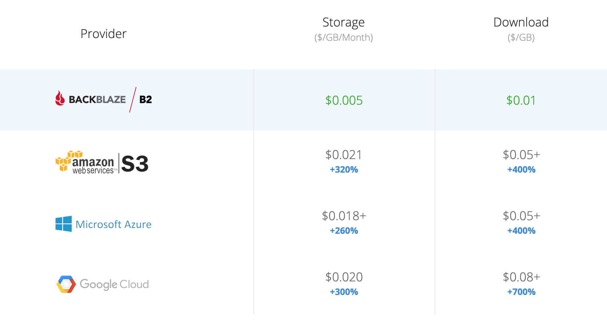

아이유 정규 5집 컴백을 앞두고 간간이 터지던 지으니어스 서버를 정비할 필요를 느꼈다. 서버 부담을 줄이기 위해 이런 저런 조치를 취해두었고 달글 기능을 쓰면 서버 부하가 크게 줄어들긴 하지만, 달글 기능을 쓰지 못하는 상황도 많고 동시 접속자가 너무 많아지면 서버가 뻗어버리는 일이 종종 발생했다. 특히 Celebrity 선공개 당일날 서버가 나가는 일도 있어서, 정규 컴백 전 그런 일을 최대한 줄여보려 했다.

일반적인 상용 서비스면 AWS 등의 클라우드에 Auto Scaling과 Load Balancer를 붙여서 Scale Up 하는 방식으로 간단(?)하게 해결이 가능하다. 하지만 운영진의 사비로 운영되고 있는 지으니어스 같은 사이트는 무작정 서버 비용을 올릴 수가 없다. AdSense 광고 수익으로 서버 비용의 일부를 충당하고 있긴 하지만, 나가는 금액이 들어오는 금액보다 크다.

현재 수준의 예산을 유지하면서 서버 사양과 서비스 품질을 올리기 위해서, 클라우드 제공 업체를 바꾸기로 했다. 지으니어스는 원래 AWS를 이용하고 있었는데, 업계 1위인 만큼 좋은 점도 많지만 일단 비용이 비싸다. 서비스 초기의 EC2 + RDS + S3 + CloudFront 조합에서 비용을 줄이기 위해 EC2를 Lightsail로 이전하고 RDS와 CloudFront를 걷어낸 상태로 지금까지 쓰고 있었지만, 이번에는 아예 다른 업체로 옮겨봤다.

이번 포스팅과 이어지는 포스팅에서는 그 과정에서 고려한 내용을 정리해보려 한다. 클라우드 이용 고객 대부분이 기업이라 그런건지, 의외로 이런 정보가 인터넷에 잘 없더라...

---

먼저 이미지 서버를 AWS S3에서 다른 오브젝트 스토리지로 옮기기로 했다. 현재 서버 비용에서 이미지 스토리지 비용은 그렇게 크지는 않은데, 문제는 매월 일정한 다른 비용에 비해 스토리지 비용은 이미지가 쌓임에 따라 점점 늘어나고 있다는 것이다.

AWS S3의 스토리지 비용은 월 [$0.025/GB](https://aws.amazon.com/s3/pricing/), 1TB 기준 월 $25로 나름 합리적이다. AWS 외에도 클라우드 3대장인 [GCP](https://cloud.google.com/storage/pricing), [Azure](https://azure.microsoft.com/en-us/pricing/details/storage/)도 비슷한 금액으로 서비스를 제공하고 있다. 비슷한 금액의 타 서비스로 굳이 AWS를 버리고 갈아탈 이유는 없기 때문에 더 저렴한 서비스인 [Wasabi](https://wasabi.com/)와 [Backblaze B2](https://www.backblaze.com/b2/cloud-storage.html)를 알아보았다. 두 서비스 모두 S3 호환 API를 제공해서 별도의 코드 변경 없이 쉽게 적용이 가능했다.

Wasabi는 **$0.0059/GB**, Backblaze B2는 **$0.005/GB**라는 AWS S3의 1/5 수준의 금액으로 서비스를 제공한다. 너무 싸서 의심될 수도 있겠지만 두 회사 모두 수년 이상 서비스를 제공하고 있는 회사들이다. 특히 개인 백업 서비스로 유명한 Backblaze는 매년 하드디스크 제조사, 모델별 고장 확률을 집계해서 공개하고 있어서 컴퓨터에 관심이 많다면 한번 정도는 들어봤을만한 회사다.

문제는 속도였는데, 국내에 데이터센터가 있는 AWS, GCP, Azure와는 다르게 Wasabi, Backblaze B2 같은 서비스는 전부 서버가 해외에 위치해있다. 하지만 국내에 서버가 위치한 오브젝트 스토리지 서비스들은 전부 AWS, GCP, Azure보다 비싸다. 비용을 줄이려면 해외 서버 외에는 답이 없는 것 같다. 속도 문제에 대해서는 후술하겠지만 국내에 캐시 서버를 두는 방식으로 보완했다.

---

처음에는 그나마 한국에서 가까운 [도쿄에 서버가 위치한](https://wasabi.com/locations/) Wasabi를 사용하려고 했다. 근데 정작 계정을 만들어서 Bucket을 생성하려고 보니 도쿄는 선택이 안 되더라. 찾아봤더니 Wasabi 도쿄 리전을 쓰려면 [NTT를 통해서만 사용이 가능하다](https://wasabi-support.zendesk.com/hc/en-us/articles/360039372392-How-do-I-access-the-Wasabi-Tokyo-ap-northeast-1-storage-region-)는 것 같다. 추후에는 바로 사용 가능하게 바꿀 예정이라고 적어놓긴 했던데, 그걸 기다릴 수는 없으니 결국 북미 리전을 사용해야 한다는 뜻이다.

Wasabi와 Backblaze B2 서비스를 비교해보면 아래와 같다.

|                | Wasabi     | Backblaze B2      |
| -------------- | ---------- | ----------------- |
| 리전           | 북미, 유럽 | 북미, 유럽        |
| 비용           | $0.0059/GB | $0.005/GB         |
| 최소 금액      | $5.99      | 없음              |
| 트래픽 비용    | 없음       | $0.01/GB          |
| API 비용       | 없음       | $0.004 per 10,000 |
| 최소 저장 기간 | 90일       | 1일               |

위의 표만 보면 별도의 트래픽, API 비용이 없는 Wasabi가 금액만 보면 더 합리적으로 보이는데, 포스팅 소제목에도 적혀있지만 최종적으로는 Backblaze B2를 선택했다.

일단 속도 문제로 오브젝트 스토리지에서 직접 HTTP 요청을 서빙하지 않고 국내에 캐시 서버를 두기 때문에 트래픽과 API 비용은 크게 의미가 없다. 더군다나 Wasabi의 무제한 트래픽 서비스는 대부분의 _무제한_ 서비스들이 그렇듯이 완전한 무제한이 [아니다](https://wasabi.com/cloud-storage-pricing/pricing-faqs/). 월평균 트래픽이 스토리지 용량 이하인 경우, 즉 1TB를 저장하는 경우 트래픽이 1TB 미만인 경우에만 사용이 가능하며, 지속적으로 이를 넘어 사용할 경우 서비스가 정지될 수 있다고 나와 있다. 캐시 서버를 별도로 둔다면 크게 상관없지만, 별도의 캐시 서버가 없다면 지으니어스의 이미지 서버 같은 서비스에는 적합하지 않다.

파일을 올리자마자 삭제하더라도 일단 3개월간의 최소 비용이 청구되는 것도 단점이다. Backblaze B2는 별도의 최소 저장 기간이 명시되어 있지는 않지만, 파일 버전을 최소 하루 동안 보관하기 때문에 실질적인 최소 저장 기간이 1일이다. 이쪽은 하루여서 큰 상관은 없지만.

위의 이유와 더불어 일단 나에게 있어 인지도가 Backblaze가 Wasabi보다 훨씬 컸기 때문에 최종적으로 Backblaze B2를 선택했다.

---



Backblaze B2의 큰 단점은 스토리지 비용에 비해 비싼 **$0.01/GB**의 트래픽 비용 (이것도 [AWS S3](https://aws.amazon.com/s3/pricing/)의 $0.09/GB에 비하면 엄청 싼 거지만), 그리고 해외 서버의 느린 속도이다. 두 문제를 해결하기 위해 국내에 캐시 서버를 세팅했다. 다음 포스팅에서도 설명하겠지만 캐시 서버는 [Vultr](https://www.vultr.com/)를 사용했다. 월 $10에 55GB SSD와 2TB 트래픽을 제공한다.

캐시 서버는 Nginx를 사용했다. Backblaze B2가 AWS S3 호환 API를 제공해주기 때문에 S3용 Nginx 모듈인 [ngx_aws_auth](https://github.com/anomalizer/ngx_aws_auth)를 그대로 쓸 수 있다.

모든 이미지를 캐시 서버에 캐싱할 수는 없지만 (그럴 거면 그냥 이미지 서버를 한국에 두면 된다), 어차피 대부분의 경우 최근에 업로드된 이미지를 보기 때문에 거의 모든 이미지는 캐시 서버에서 서빙된다. 아주 오래된 글을 보는 경우 북미에 위치한 B2 서버에서 이미지를 받아오느라 딜레이가 생길 수는 있겠지만, 이외의 경우 S3 서울 리전과 큰 차이가 없다.

해외에서는 Backblaze B2에 [Cloudflare](https://www.cloudflare.com/)를 같이 사용해서 트래픽 비용을 절감하는 경우가 많은 것 같은데, Cloudflare는 무료 플랜에 한국 리전을 제공해주지 않기 때문에 국내에서는 무용지물이다.

---

이전 작업은 AWS S3의 파일을 다운로드 한 뒤 다시 Backblaze B2로 업로드 하는 스크립트를 짜서 진행했다. 일단 2017년 11월부터 2021년 2월까지의 이미지 파일을 이전한 뒤, 이미지 업로드 시 S3와 B2 두 군데에 모두 업로드되도록 설정을 바꾸고, 이후 그사이 며칠 간의 파일을 마저 이전해 빠진 파일 없이 이전했다. 이후 도메인을 새로운 캐시 서버를 가리키도록 바꾸어 서버 Downtime 없이 이전에 성공했다. (오늘 새벽에 있었던 [서버 점검](https://jieuninus.com/board/free/524449)은 이미지 서버 이전과는 상관없다.)

이 과정에서 Backblaze B2의 의외의 이점이 있었는데, S3 호환 API가 아닌 자체 API인 B2 Native API를 사용할 경우 [파일 목록 API](https://www.backblaze.com/b2/docs/b2_list_file_names.html)에 파일의 MD5, SHA1 해시가 같이 넘어온다. 파일들이 전부 제대로 업로드되었는지 다운로드를 안 하고 쉽게 확인할 수 있었다.

---

Backblaze B2의 장단점을 정리하면 이렇다.

### 장점

- **가격**
- 웹 UI의 편리함 (S3보다 많이 편하다. 이건 S3가 기능이 워낙 많아서도 있겠지만)
- B2 Native API 사용 시 파일 해시 확인 가능
- FedEx로 외장하드에 데이터를 담아 보내주는 서비스 (이건 쓸 일이 없었으면 좋겠다 -\_-)

### 단점

- **해외 서버**, 느림
- 스토리지 비용에 비해 비싼 트래픽 비용
- 정보가 적음

마지막 단점이 의외로 치명적이었는데, 구글링을 조금만 해도 정보가 쏟아지는 S3와 다르게 정보가 거의 없다. 아니, 공식 문서를 제외하고는 아예 없다고 봐도 무방하다. 사용자층이 적어서 생기는 문제겠지만 Troubleshooting이 쉽지 않다.

예를 들어 현재 캐시 서버에 사용 중인 [ngx_aws_auth](https://github.com/anomalizer/ngx_aws_auth)를 Backblaze B2 같은 S3 호환 서비스에 사용하기 위해서는 `aws_endpoint` 설정을 따로 해주어야 하는데, 설정 했는데도 적용이 되지 않아 조금 헤맸었다.

```
server {
    listen     8000;

    aws_access_key your_aws_access_key; # Example AKIDEXAMPLE
    aws_key_scope scope_of_generated_signing_key; #Example 20150830/us-east-1/service/aws4_request
    aws_signing_key signing_key_generated_using_script; #Example L4vRLWAO92X5L3Sqk5QydUSdB0nC9+1wfqLMOKLbRp4=
    aws_s3_bucket your_s3_bucket;
    aws_endpoint s3.us-west-000.backblazeb2.com;

    location / {
      aws_sign;
    }
}
```

처음에는 이렇게 설정을 했었는데, ngx_aws_auth의 `aws_endpoint` 설정은 `location` 블록 안에 넣어줘야 하나 보다.

```
server {
    listen     8000;

    location / {
        aws_sign;
        aws_access_key your_aws_access_key; # Example AKIDEXAMPLE
        aws_key_scope scope_of_generated_signing_key; #Example 20150830/us-east-1/service/aws4_request
        aws_signing_key signing_key_generated_using_script; #Example L4vRLWAO92X5L3Sqk5QydUSdB0nC9+1wfqLMOKLbRp4=
        aws_s3_bucket your_s3_bucket;
        aws_endpoint s3.us-west-000.backblazeb2.com;
    }
}
```

이렇게 변경하면 오류가 나지 않는다.

뭐 이건 따지고 보면 Backblaze B2 문제라기보단 ngx_aws_auth 문제겠지만, 처음 문제가 발생했을 때는 이게 Backblaze B2 문제인지 다른 문제인지 바로 식별이 되지 않으니 헤매기 쉽다. 디버깅해 본 뒤에야 endpoint 설정 문제라는걸 알 수 있으니... 에러 메시지만 구글링하면 해결 방법이 나오는 것과 일일이 공식 문서 뒤져보고 디버깅하는 것과는 공수 차이가 크다.

블로그 포스팅을 남기는 것도 혹시 모를 Backblaze B2나 Wasabi를 고민 중인 다른 개발자들을 위해서이다. 해외도 해외인데 국내는 정보가 너무 없더라.

아무튼 이렇게 이미지 스토리지를 Backblaze B2로 이전해서 스토리지 비용을 1/5로 절감했다.
