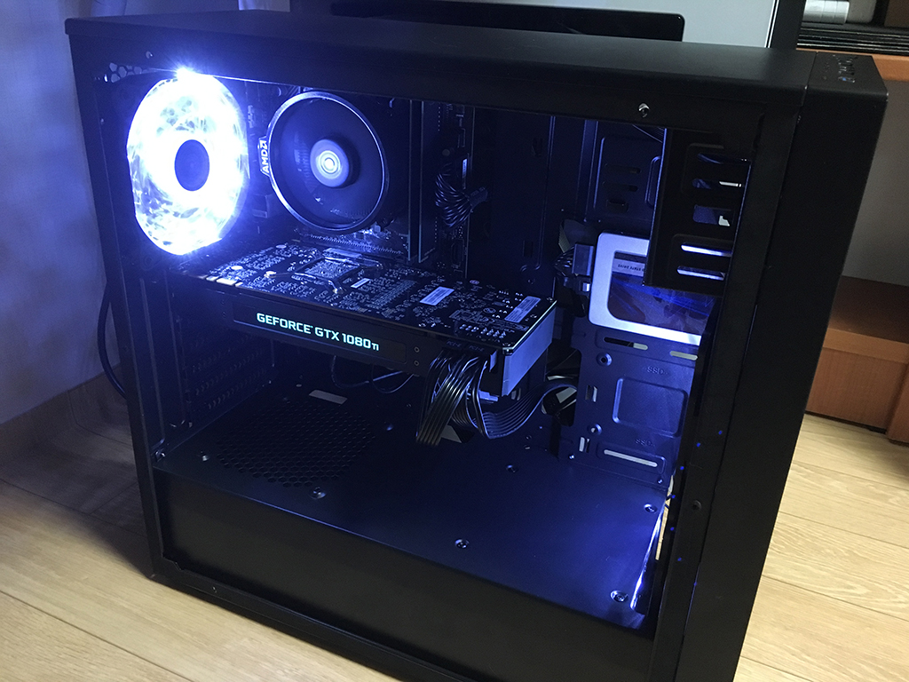

지난 포스팅에도 나와있지만, 이전에는 딥러닝 학습이 필요할 때마다 클라우드를 사용하곤 했다. macOS에서 NVIDIA 그래픽 카드가 지원이 되지 않기 때문에 지금 메인으로 사용하고 있는 컴퓨터에는 RX 580이 달려있고, AMD 상에서 딥러닝을 제대로 돌리기는 거의 불가능에 가깝다. ROCm도 써봤는데... 답이 없다.

그래서 GCP를 사용했었는데, 써본 사람들은 알겠지만 무진장 비싸다. Preemptible 인스턴스를 사용하면 헐값에 쓸 수 있긴 하지만 언제 멈출지 몰라 불안하기도 하고 24시간마다 다시 켜줘야된다는거도 엄청 귀찮기 마련. (뭐 이건 자동화가 가능하긴 하다만) 학습 데이터를 일일히 클라우드로 업로드하고 학습이 된 모델을 다시 다운로드하는거도 귀찮고.

무엇보다 매시간 과금되는 클라우드 특성상 다양한 실험을 해볼만한 여유가 안생겼다. 딥러닝 모델을 최적화하려면 이것저것 바꿔보면서 일단 돌려봐야 하는 일이 많은데, 그럼 돈도 n배로 드니까. 내가 뭐 돈 받고 연구하는 것도 아니고 취미로 하는 일에 계속 그렇게 돈을 쏟아 부을 수는 없으니...

결국은 로컬에 딥러닝 학습 머신을 구축하기로 했다.

---

마음은 라이젠 3700X에 RTX 2080 Ti를 달고 싶었지만, 예산의 한계로 한세대 이전 부품을 사용해 최대한 돈을 아껴보기로 했다.

GPU를 RTX 2070을 쓸지 GTX 1080 Ti를 쓸지 꽤 고민했는데, 결론은 11GB VRAM을 달고 있는 1080 Ti로 정했다. RTX 2070에 텐서 코어가 달려있고 FP16 연산을 지원해서 더 나은 부분이 있을거 같긴 한데, 내 관심 분야에선 VRAM 쓸 일이 더 많더라. RTX 2080 Ti 달면 제일 좋은데 너무 비싸잖아...

CPU는 가성비의 라이젠 2600으로 정했다. 3600 정도는 달아줄까 잠시 고민했지만 어차피 딥러닝용 머신이라 CPU 쓸 일이 그렇게 많지 않기도 하고 2600 정도면 충분해서. 두배 가까이 되는 가격을 투자할 필요는 없는 것 같다.

아무튼 최종 사양은 이렇다.

- CPU: AMD 라이젠 5 2600
- M/B: MSI A320M-A PRO
- RAM: ESSENCORE KLEVV DDR4 8G PC4-21300 CL16 x 2 (16GB)
- GPU: PNY GeForce GTX 1080 Ti 11GB Blower Design
- SSD: Crucial MX300 750GB
- CASE: 잘만 N2
- PWR: 마이크로닉스 Classic II 600W +12V Single Rail 85+

SSD는 집에 굴러다니던걸 사용했고, 그래픽 카드는 중고로 40만원에 구매했다. 나머지 부품들은 35만원, 총 75만원짜리 극한의 가성비의 딥러닝 PC이다.

---

새해가 되어서야 포스팅을 하고 있지만 조립이 끝난건 작년 11월 초이다. 두달 동안 열심히 갈궜다 ㅋㅋ 이거 대신 GCP 돌렸을 때의 가격만큼은 충분히 뽑은듯 :D

아이유 Siri 프로젝트에 multi-speaker를 적용해 보기도 했고 (댓글로도 적었지만 이전보다는 훨 나아지긴 했는데, 아무래도 제대로된 결과를 얻기 위해선 데이터셋 분량 확보가 필수적인거 같다) 그 외 GAN을 이용한 Upscaling, 이미지 인식 등에 사용하고 있다.
